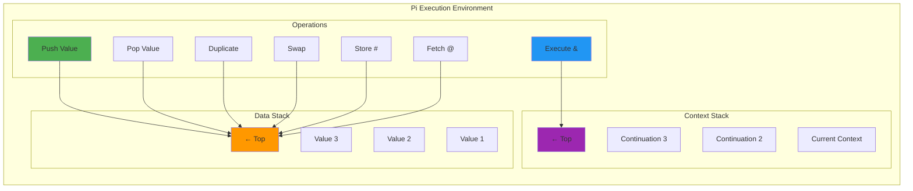
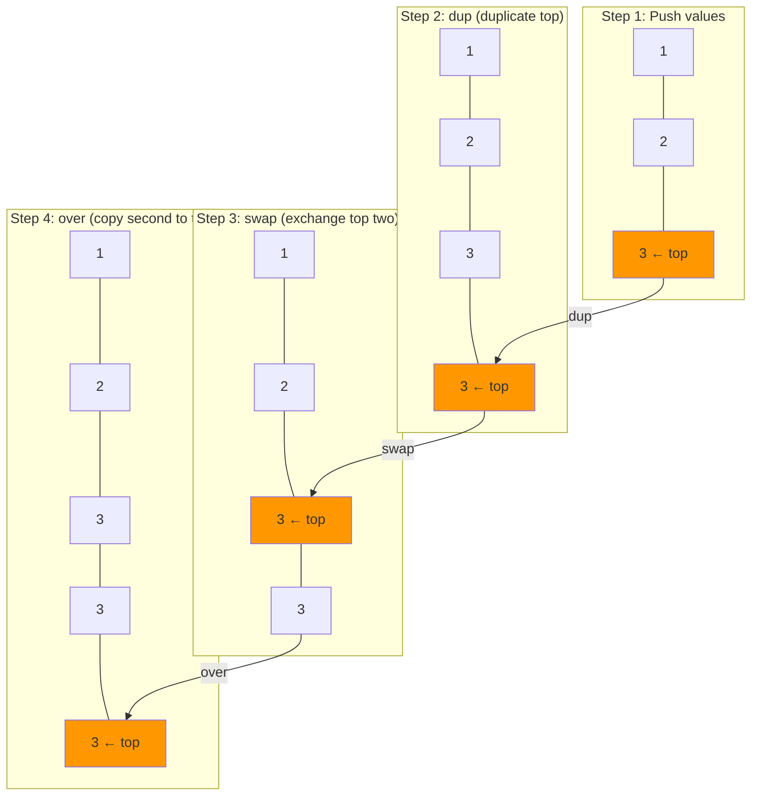
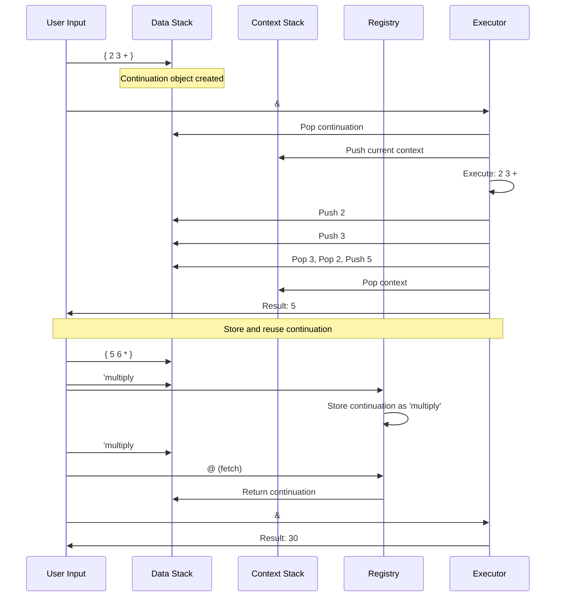
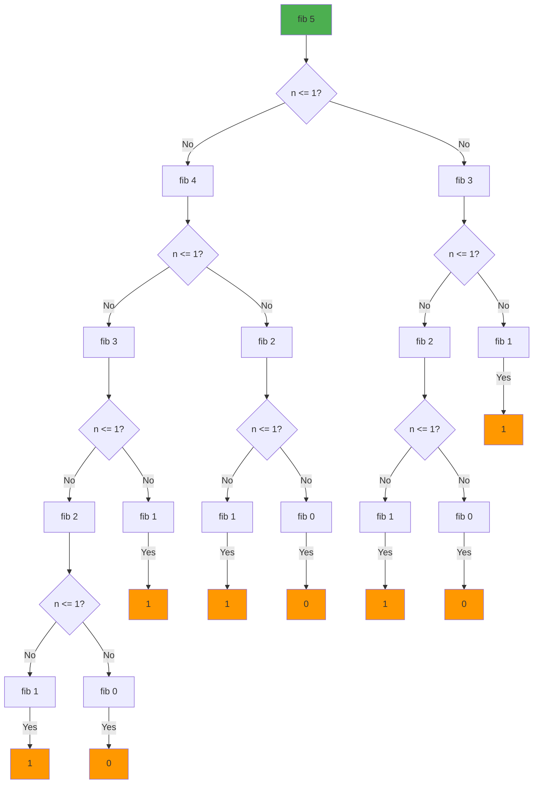

# Pi Language Tutorial

Pi is a stack-based language in the KAI system, heavily influenced by Forth. This tutorial provides a comprehensive introduction to Pi, covering its fundamental concepts and advanced features.

## Introduction to Pi

Pi is a Reverse Polish Notation (RPN) language where operations are expressed by placing operators after their operands. It serves as the foundation for KAI's language ecosystem, with both Rho and Tau ultimately translating to Pi operations.

### Key Characteristics

- **Stack-based**: Operations manipulate values on stacks rather than using variables
- **Two primary stacks**: data stack (for values) and context stack (for control flow)
- **Postfix notation**: Operators follow their operands
- **Minimalist syntax**: Very few syntax rules, making it easy to parse and execute
- **Powerful**: Despite its simplicity, Pi can express complex operations and control flow

### Getting Help in the Console

The KAI Console provides comprehensive help for Pi:

```bash
# Start the Console in Pi mode (default)
$ ./Console

Pi λ help pi
Pi Language Reference

Pi is a stack-based language with postfix notation.

Basic Operations:
  2 3 +           # Push 2, push 3, add (result: 5)
  10 3 -          # Subtract (result: 7)
  4 5 *           # Multiply (result: 20)
  15 3 /          # Divide (result: 5)

Stack Operations:
  dup             # Duplicate top of stack
  swap            # Swap top two elements
  drop            # Remove top element
  over            # Copy second element to top

Control Flow:
  if then else    # Conditional execution
  while do        # Loop while condition is true

Pi λ help basics  # For general Console usage
Pi λ help         # For all available help topics
```

## Basic Stack Operations

Pi primarily manipulates two stacks:
1. **Data stack**: Holds values being operated on
2. **Context stack**: Controls program flow (continuations, functions, etc.)

### Pi Two-Stack Architecture



### Stack Manipulation Commands

```pi
// Push values 1, 2, 3 onto the stack
1 2 3

// Duplicate the top stack item (3)
dup    // Stack is now: 1 2 3 3

// Remove the top stack item
drop   // Stack is now: 1 2 3

// Swap the top two stack items
swap   // Stack is now: 1 3 2

// Copy the second item to the top
over   // Stack is now: 1 3 2 3

// Get the stack depth
depth  // Stack is now: 1 3 2 3 4

// Clear the entire stack
clear  // Stack is now empty
```

### Stack Operation Visual Example



## Arithmetic Operations

Pi supports standard arithmetic operations, which take their operands from the stack and push the result back:

```pi
// Addition: 2 + 3 = 5
2 3 +

// Subtraction: 5 - 2 = 3
5 2 -

// Multiplication: 4 * 3 = 12
4 3 *

// Division: 10 / 2 = 5
10 2 div

// Modulo: 7 % 4 = 3
7 4 mod
```

## Logical Operations

Pi includes a complete set of logical operations:

```pi
// Logical operators
true false and  // false
true false or   // true
true not        // false

// Comparison operations
3 5 <           // true
7 5 >           // true
5 5 ==          // true
5 6 !=          // true
```

## Variables and Memory

Pi allows you to store and retrieve values using a dictionary-like system:

```pi
// Store value 42 with name 'answer'
42 'answer #

// Retrieve the value associated with 'answer'
'answer @     // Pushes 42 onto the stack
```

## Control Structures

### Conditionals

```pi
// If-else using ife operation
// Syntax: then-branch else-branch condition ife

// If true, push 1, otherwise push 2
1 2 true ife   // Result: 1

// If false, push 1, otherwise push 2
1 2 false ife  // Result: 2
```

### Continuations

Continuations are a powerful concept in Pi, representing code to be executed:

```pi
// Define a continuation (code block)
{ 2 3 + }    // Pushes a continuation object

// Execute a continuation using &
{ 2 3 + } &  // Executes the continuation, resulting in 5

// Store a continuation
{ 5 6 * } 'multiply #

// Retrieve and execute the continuation
'multiply @ &  // Executes the stored continuation, resulting in 30
```

### Continuation Execution Flow



### Continuation Control Operations

Pi provides three powerful operations for controlling the flow of continuations:

```pi
// Suspend: Temporarily pause current execution and switch to a new continuation
{ "Side task" trace } suspend  // Will return to the current context later

// Resume: Exit the current continuation and return to the previously suspended one
{ "Breaking out early" trace resume } &  // Immediate exit

// Replace: Completely substitute the current continuation with a new one
{ "New execution path" trace } replace  // Permanent transition
```

These operations form the foundation for advanced control flow patterns in KAI. For detailed explanations and examples, see the [Continuation Control documentation](ContinuationControl.md).

## Arrays and Collections

Pi supports creating and manipulating arrays:

```pi
// Create an empty array
[]

// Create array with elements
[1 2 3]

// Access array elements (0-indexed)
[10 20 30] 1 index  // Returns 20

// Array operations
[1 2 3] size         // Returns 3
[1 2 3] [4 5 6] +    // Concatenates to [1 2 3 4 5 6]
```

## Advanced Features

### Function Definition and Calling

Functions in Pi are implemented as continuations:

```pi
// Define a function to add two numbers
{ + } 'add #

// Call the function
5 3 'add @ &  // Results in 8

// Functions with multiple operations
{ dup * } 'square #
4 'square @ &  // Results in 16
```

### Recursion

Pi supports recursion through self-referential continuations:

```pi
// Factorial function using recursion
{
  dup 1 <= 
  { drop 1 } 
  { dup 1 - 'factorial @ & * } 
  ife
} 'factorial #

5 'factorial @ &  // Calculates 5! = 120
```

## Integration with Rho

One of Pi's most powerful features is its ability to be embedded within Rho code:

```rho
// Embedding Pi in Rho
result = 10 + pi{ 3 4 + }  // result = 10 + 7 = 17

// Pi code blocks
pi{
  1 2 +        // Computes 1 + 2
  'x #         // Stores in variable x
}
x_value = x @  // Retrieves value of x (3)
```

## Debugging Techniques

Pi provides several operations for debugging:

```pi
// Print the entire stack without modifying it
.s

// Trace a value (print it)
42 trace

// Assert a condition (useful for testing)
1 1 + 2 == assert

// Intentionally cause an error for testing
"Error message" die
```

## Best Practices

1. **Stack Discipline**: Keep track of what's on the stack at all times
2. **Comments**: Use `//` for comments to document complex operations
3. **Testing**: Use `assert` to verify your code behaves as expected
4. **Modularity**: Define reusable functions for common operations
5. **Stack Cleanup**: Always leave the stack in a clean state when a function ends

## Example: Computing Fibonacci Numbers

Here's an elegant example that computes Fibonacci numbers using Pi:

```pi
// Fibonacci function - compact implementation
{
  dup 1 <= 
  { } 
  { dup 1 - 'fib @ & swap 1 - 1 - 'fib @ & + } 
  ife
} 'fib #

// Calculate the 10th Fibonacci number
10 'fib @ &  // Result: 55
```

### Fibonacci Recursion Flow



An optimized version using memoization to avoid redundant calculations:

```pi
// Create an empty array to cache results
[] 'fib_cache #

// Optimized Fibonacci function
{
  // Check if we already calculated this value
  dup 'fib_cache @ swap dup rot array_has_index
  { 'fib_cache @ swap array_get }
  {
    // Not in cache, compute it
    dup 1 <=
    { }
    { 
      // Calculate fib(n-1) and fib(n-2)
      dup 1 - 'fib_memo @ &
      swap 2 - 'fib_memo @ &
      +
      
      // Store in cache before returning
      dup rot 'fib_cache @ swap rot array_set 'fib_cache #
    }
    ife
  }
  ife
} 'fib_memo #

// Calculate the 30th Fibonacci number (would be very slow without memoization)
30 'fib_memo @ &  // Result: 832040
```

## Real-World Applications

Pi is particularly useful for:

1. **Engine scripting**: Low-level system control
2. **Data transformations**: Stack-based processing of data streams
3. **Network protocols**: Encoding and decoding binary data
4. **Expression evaluation**: Mathematical and logical expressions
5. **Core of the KAI system**: Providing a common execution model for other languages

## Conclusion

Pi's minimalist design and powerful semantics make it an excellent foundation for KAI's language ecosystem. While it may have a learning curve due to its stack-based nature, mastering Pi provides deep insights into how computation works and enables you to leverage KAI's capabilities to their fullest.

For practical examples, explore the [Pi test scripts](../Test/Language/TestPi/Scripts) which demonstrate various aspects of the language.