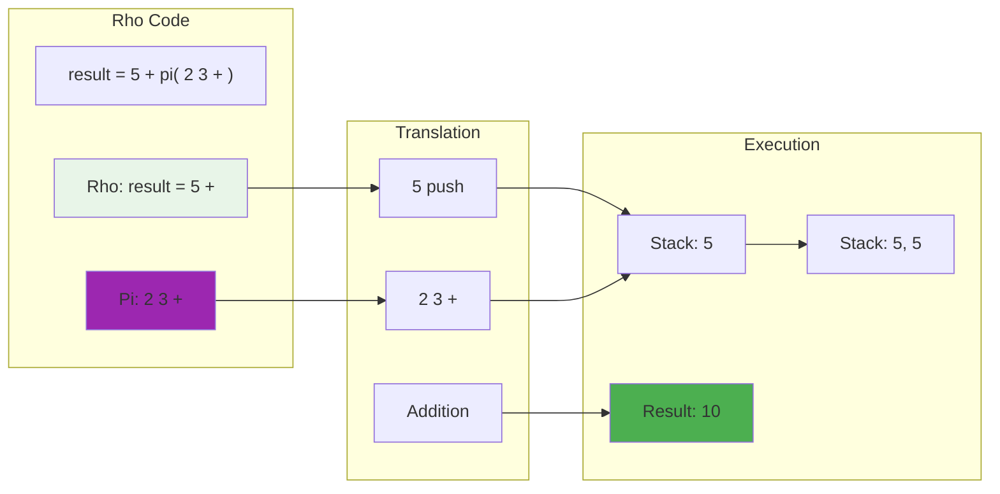

# Rho Language Tutorial

Rho is an infix-notation language in the KAI system, designed to be more familiar to programmers coming from languages like Python, Ruby, or JavaScript. What makes Rho special is its seamless integration with Pi and its native support for continuations.

## Introduction to Rho

Rho provides a higher-level programming experience than Pi while retaining access to Pi's powerful capabilities. It compiles down to Pi operations, making it both expressive and efficient.

### Key Characteristics

- **Infix notation**: Conventional syntax with operators between operands
- **Python-like**: Similar syntax to Python, making it accessible to many developers
- **Pi integration**: Can embed Pi code directly within Rho expressions
- **First-class continuations**: Native support for advanced control flow
- **Strong typing**: Maintains type safety across operations

### Getting Help in the Console

The KAI Console provides comprehensive help for Rho:

```bash
# Start the Console in Rho mode
$ ./Console -l rho

Rho λ help rho
Rho Language Reference

Rho is a C-like language with modern features.

Variables and Assignment:
  x = 42;         # Assign value to variable
  y = x * 2;      # Use variables in expressions

Control Structures:
  if (condition) { ... } # Conditional
  while (condition) { ... } # Loop
  for (i = 0; i < 10; i++) { ... } # For loop

Functions:
  fun name(args) { ... } # Define function
  name(arguments); # Call function

Rho λ rho          # Switch to Rho mode from Pi
Rho λ help basics  # For general Console usage
Rho λ help         # For all available help topics
```

## Basic Syntax

### Variables and Assignment

```rho
// Variable assignment
x = 42
name = "Alice"
is_valid = true

// Multiple assignments
a = b = c = 0

// Compound assignments
count = 10
count += 5      // count is now 15
count -= 3      // count is now 12
count *= 2      // count is now 24
count /= 4      // count is now 6
```

### Arithmetic Operations

```rho
// Basic arithmetic
sum = 5 + 3         // 8
difference = 10 - 4  // 6
product = 7 * 6      // 42
quotient = 20 / 5    // 4
remainder = 10 % 3   // 1

// Combined operations with proper precedence
result = (4 + 2) * 3 - 5  // 13
```

### Logical Operations

```rho
// Boolean operations
a = true
b = false

result1 = a && b     // false (logical AND)
result2 = a || b     // true (logical OR)
result3 = !a         // false (logical NOT)

// Comparison operations
x = 5
y = 10

is_equal = x == y            // false
is_different = x != y        // true
is_greater = x > y           // false
is_less = x < y              // true
is_greater_equal = x >= y    // false
is_less_equal = x <= y       // true
```

## Control Structures

### Conditionals

```rho
// Basic if statement
if x > 10 {
    print("x is greater than 10")
}

// If-else statement
if score >= 60 {
    grade = "Pass"
} else {
    grade = "Fail"
}

// Nested if-else
if temperature > 30 {
    weather = "Hot"
} else if temperature > 20 {
    weather = "Warm"
} else if temperature > 10 {
    weather = "Cool"
} else {
    weather = "Cold"
}
```

### Loops

```rho
// While loop
counter = 0
while counter < 5 {
    counter = counter + 1
}

// For loop (similar to C-style for loop)
sum = 0
for (i = 0; i < 10; i = i + 1) {
    sum = sum + i
}

// Do-while loop (executes at least once)
i = 0
do
    i = i + 1
while i < 5
```

## Data Structures

### Arrays

```rho
// Create an empty array
empty_array = []

// Create an array with elements
numbers = [1, 2, 3, 4, 5]

// Access elements (0-indexed)
first = numbers[0]    // 1
third = numbers[2]    // 3

// Array properties
size = numbers.Count  // 5

// Array modification
numbers[1] = 20       // numbers is now [1, 20, 3, 4, 5]
```

### Maps/Dictionaries

```rho
// Create a map (not natively supported yet, but conceptual example)
person = {"name": "John", "age": 30, "city": "New York"}

// Access map elements
name = person["name"]    // "John"
```

## Functions

### Function Definition and Calling

```rho
// Basic function definition
fun add(a, b) {
    return a + b
}

// Call the function
result = add(5, 3)    // 8

// Function with no parameters
fun getCurrentTime() {
    return System.Time
}

// Functions that don't return values
fun logMessage(message) {
    System.Log(message)
}

// Function with default behavior (no explicit return)
fun greet(name) {
    message = "Hello, " + name
    // Last expression is implicitly returned
    message
}
```

### Anonymous Functions

```rho
// Anonymous function assigned to a variable
square = fun(x) { return x * x }

// Using an anonymous function
squared_value = square(4)    // 16

// Passing functions as arguments
numbers = [1, 2, 3, 4, 5]
doubled = map(numbers, fun(x) { return x * 2 })
```

## Pi Integration

### Rho-Pi Language Integration



One of Rho's most powerful features is its seamless integration with Pi code:

```rho
// Using Pi within a Rho expression
result = 5 + pi{ 2 3 + }    // 5 + 5 = 10

// Dedicated Pi block
pi{
    1 2 3        // Push values onto the stack
    + +          // Add them together
    'sum #       // Store in variable 'sum'
}

// Access Pi variables from Rho
total = sum @    // Retrieves the value stored in 'sum'

// Converting between Pi and Rho
pi_function = pi{ dup * }
rho_result = pi_function(5)    // 25
```

## Advanced Features

### Continuations

Rho has first-class support for continuations, allowing for powerful control flow:

```rho
// Creating and executing a continuation
cont = {
    x = 10
    y = 20
    x + y
}

result = cont()    // 30

// Continuations can capture their lexical environment
x = 5
incrementor = { x = x + 1 }
incrementor()
incrementor()
// x is now 7
```

### Error Handling

```rho
// Basic error handling with assertions
assert(x > 0, "x must be positive")

// Try-catch pattern (conceptual example)
try {
    result = riskyOperation()
} catch (error) {
    handleError(error)
}
```

## Object-Oriented Patterns

While Rho doesn't have explicit class definitions, you can use functions and dictionaries to create object-like structures:

```rho
// Constructor function for a "class"
fun createPerson(name, age) {
    return {
        "name": name,
        "age": age,
        "greet": fun() { 
            return "Hello, my name is " + name
        }
    }
}

// Creating an "instance"
person = createPerson("Alice", 30)

// Accessing properties and methods
person_name = person["name"]    // "Alice"
greeting = person["greet"]()   // "Hello, my name is Alice"
```

## Interoperability with KAI

Rho provides full access to the KAI system:

```rho
// Accessing KAI's registry
registry = System.Registry

// Creating new objects
vector = registry.New("Vector3", 1.0, 2.0, 3.0)

// Calling methods on KAI objects
normalizedVector = vector.Normalize()

// Interacting with the network
node = Network.CreateNode()
node.Connect("192.168.1.100", 8080)
```

## Debugging Techniques

```rho
// Print values for debugging
System.Print("Debug value: " + x)

// Assertions for validation
assert(result == expected, "Calculation failed")

// Tracing execution
System.Trace("Reached point A with value " + value)
```

## Best Practices

1. **Consistent Style**: Follow a consistent coding style for readability
2. **Meaningful Names**: Use descriptive variable and function names
3. **Comments**: Add comments for complex logic, but prefer self-documenting code
4. **Modular Design**: Break code into reusable functions
5. **Testing**: Use assertions to validate expected behavior
6. **Pi Integration**: Use Pi judiciously where it offers advantages (stack manipulation, etc.)

## Example: Fibonacci Sequence

Here's a complete example implementing the Fibonacci sequence in different ways:

```rho
// Recursive Fibonacci implementation
fun fibonacci_recursive(n) {
    if (n <= 1) {
        return n
    } else {
        return fibonacci_recursive(n - 1) + fibonacci_recursive(n - 2)
    }
}

// Iterative Fibonacci implementation (more efficient)
fun fibonacci_iterative(n) {
    if (n <= 1) {
        return n
    }
    
    a = 0
    b = 1
    
    for (i = 2; i <= n; i = i + 1) {
        temp = b
        b = a + b
        a = temp
    }
    
    return b
}

// Using Pi for Fibonacci (for comparison)
fun fibonacci_pi(n) {
    return pi{
        // Convert n to Pi value
        n @
        
        // If n <= 1, return n
        dup 1 <= {
            // Nothing to do, n is already on stack
        } {
            // Else compute fib(n-1) + fib(n-2)
            dup 1 - 'fibonacci_internal @ &
            swap 2 - 'fibonacci_internal @ &
            +
        } ife
    }
}

// Calculate and print results
result1 = fibonacci_recursive(10)    // 55
result2 = fibonacci_iterative(10)    // 55
result3 = fibonacci_pi(10)           // 55

assert(result1 == result2 && result2 == result3, "All implementations should match")
```

## Real-World Applications

Rho is particularly well-suited for:

1. **Application logic**: Higher-level business logic in KAI applications
2. **Scripting**: Configurable behaviors and user-defined actions
3. **Rapid prototyping**: Quick implementation of ideas
4. **System integration**: Coordinating between different components
5. **Network programming**: Controlling distributed KAI systems

## Conclusion

Rho provides a powerful and expressive programming environment within the KAI system. Its familiar syntax combined with direct access to Pi's capabilities makes it both accessible and powerful. By mastering Rho, you can take full advantage of KAI's distributed object model while writing clear, maintainable code.

For practical examples, explore the [Rho test scripts](../Test/Language/TestRho/Scripts) which demonstrate various aspects of the language.