# Tau Architecture Diagrams

This document provides comprehensive visual documentation of the Tau Interface Definition Language (IDL) system, including its processing pipeline, code generation architecture, and network integration patterns.

## Table of Contents

1. [System Overview](#system-overview)
2. [IDL Processing Pipeline](#idl-processing-pipeline) 
3. [Code Generation Architecture](#code-generation-architecture)
4. [Proxy/Agent Network Interaction](#proxyagent-network-interaction)
5. [Class Hierarchy and Relationships](#class-hierarchy-and-relationships)
6. [Event System Architecture](#event-system-architecture)
7. [Type System and Serialization](#type-system-and-serialization)

## System Overview

The Tau system provides a complete IDL solution for distributed computing within the KAI framework.

```mermaid
graph TB
    subgraph "Input Layer"
        TAU_FILES["📄 .tau Files<br/>Interface definitions<br/>Service contracts<br/>Data structures"]
    end
    
    subgraph "Tau Language System"
        LEXER["🔍 TauLexer<br/>Tokenization<br/>Keyword recognition<br/>Symbol parsing"]
        PARSER["🌳 TauParser<br/>AST construction<br/>Syntax validation<br/>Error reporting"]
        AST_NODES["📦 TauAstNode<br/>Interface nodes<br/>Method nodes<br/>Type nodes<br/>Event nodes"]
    end
    
    subgraph "Code Generation Engine"
        GEN_PROCESS["⚙️ GenerateProcess<br/>Base generation logic<br/>Common utilities<br/>Output management"]
        GEN_PROXY["🔄 GenerateProxy<br/>Client-side stubs<br/>Network calls<br/>Parameter serialization"]
        GEN_AGENT["🏠 GenerateAgent<br/>Server-side handlers<br/>Request processing<br/>Response generation"]
        GEN_STRUCT["📋 GenerateStruct<br/>Data structures<br/>Serialization support<br/>Type definitions"]
    end
    
    subgraph "Generated Output"
        CPP_PROXY["📁 Proxy Classes<br/>*.h files<br/>Client interfaces<br/>Network abstraction"]
        CPP_AGENT["📁 Agent Classes<br/>*.h files<br/>Server handlers<br/>Implementation stubs"]
        CPP_STRUCT["📁 Struct Definitions<br/>*.h files<br/>Data types<br/>Serialization code"]
    end
    
    subgraph "Runtime Integration"
        NETWORK["🌐 Network Layer<br/>RakNet BitStreams<br/>Message routing<br/>Connection management"]
        KAI_CORE["🏗️ KAI Core<br/>Object system<br/>Registry<br/>Memory management"]
    end
    
    TAU_FILES --> LEXER
    LEXER --> PARSER
    PARSER --> AST_NODES
    AST_NODES --> GEN_PROCESS
    GEN_PROCESS --> GEN_PROXY
    GEN_PROCESS --> GEN_AGENT
    GEN_PROCESS --> GEN_STRUCT
    GEN_PROXY --> CPP_PROXY
    GEN_AGENT --> CPP_AGENT
    GEN_STRUCT --> CPP_STRUCT
    CPP_PROXY --> NETWORK
    CPP_AGENT --> NETWORK
    CPP_STRUCT --> KAI_CORE
    NETWORK --> KAI_CORE
    
    style TAU_FILES fill:#e1bee7,stroke:#333,stroke-width:2px
    style GEN_PROCESS fill:#ff9800,stroke:#333,stroke-width:2px
    style CPP_PROXY fill:#4caf50,stroke:#333,stroke-width:2px
    style CPP_AGENT fill:#2196f3,stroke:#333,stroke-width:2px
    style CPP_STRUCT fill:#9c27b0,stroke:#333,stroke-width:2px
    style NETWORK fill:#f44336,stroke:#333,stroke-width:2px
```



## IDL Processing Pipeline

Detailed view of how Tau processes interface definitions through lexical analysis, parsing, and AST construction.

```mermaid
flowchart TD
    subgraph "Input Processing"
        INPUT["📝 Tau Source Code<br/><pre><code>namespace Services {<br/>  interface ICalculator {<br/>    float add(float a, float b);<br/>    void clear();<br/>    event ResultReady(float result);<br/>  }<br/>}</code></pre>"]
    end
    
    subgraph "Lexical Analysis"
        LEXER_START["🚀 TauLexer::Process()"]
        TOKEN_STREAM["📊 Token Stream"]
        TOKENS["🏷️ Token Types<br/>• NAMESPACE<br/>• IDENTIFIER<br/>• INTERFACE<br/>• FLOAT<br/>• EVENT<br/>• SEMICOLON<br/>• BRACES"]
    end
    
    subgraph "Parsing & AST Construction"
        PARSER_START["🌱 TauParser::Process()"]
        AST_BUILD["🔨 AST Construction"]
        
        subgraph "AST Node Types"
            MODULE_NODE["📦 Module Node<br/>Root namespace container"]
            NAMESPACE_NODE["🏷️ Namespace Node<br/>Services"]
            INTERFACE_NODE["🔌 Interface Node<br/>ICalculator"]
            METHOD_NODE["⚡ Method Node<br/>add(), clear()"]
            EVENT_NODE["📡 Event Node<br/>ResultReady"]
            TYPE_NODE["🔢 Type Node<br/>float, void"]
            PARAM_NODE["📋 Parameter Node<br/>a, b, result"]
        end
    end
    
    subgraph "Validation & Error Handling"
        VALIDATE["✅ Syntax Validation"]
        TYPE_CHECK["🔍 Type Checking"] 
        ERROR_REPORT["⚠️ Error Reporting"]
    end
    
    INPUT --> LEXER_START
    LEXER_START --> TOKEN_STREAM
    TOKEN_STREAM --> TOKENS
    TOKENS --> PARSER_START
    PARSER_START --> AST_BUILD
    AST_BUILD --> MODULE_NODE
    MODULE_NODE --> NAMESPACE_NODE
    NAMESPACE_NODE --> INTERFACE_NODE
    INTERFACE_NODE --> METHOD_NODE
    INTERFACE_NODE --> EVENT_NODE
    METHOD_NODE --> TYPE_NODE
    METHOD_NODE --> PARAM_NODE
    EVENT_NODE --> TYPE_NODE
    EVENT_NODE --> PARAM_NODE
    
    AST_BUILD --> VALIDATE
    VALIDATE --> TYPE_CHECK
    TYPE_CHECK --> ERROR_REPORT
    
    style INPUT fill:#e8f5e8,stroke:#4caf50,stroke-width:2px
    style LEXER_START fill:#fff3e0,stroke:#ff9800,stroke-width:2px
    style PARSER_START fill:#e3f2fd,stroke:#2196f3,stroke-width:2px
    style VALIDATE fill:#f3e5f5,stroke:#9c27b0,stroke-width:2px
```



## Code Generation Architecture

Comprehensive view of the code generation system showing the inheritance hierarchy and generation patterns.


## Proxy/Agent Network Interaction

Detailed sequence diagram showing the complete network communication flow between proxy and agent.

```mermaid
sequenceDiagram
    participant App as Client Application
    participant Proxy as Generated Proxy<br/>ICalculatorProxy
    participant NetLayer as Network Layer<br/>RakNet/BitStream
    participant AgentNet as Network Layer<br/>Remote Node
    participant Agent as Generated Agent<br/>ICalculatorAgent
    participant Impl as Server Implementation<br/>Calculator
    
    Note over App,Impl: Method Call Flow
    
    App->>+Proxy: calculator.add(5.0, 3.0)
    Proxy->>Proxy: Validate parameters
    Proxy->>+NetLayer: CreateMethodCall("add")
    
    Note right of Proxy: Serialization
    Proxy->>NetLayer: BitStream << 5.0
    Proxy->>NetLayer: BitStream << 3.0
    
    NetLayer->>NetLayer: Package message with headers
    NetLayer->>AgentNet: Send over network
    
    Note over NetLayer,AgentNet: Network Transport
    
    AgentNet->>+Agent: Handle_add(BitStream, sender)
    
    Note right of Agent: Deserialization
    Agent->>Agent: float a; bs >> a
    Agent->>Agent: float b; bs >> b
    
    Agent->>+Impl: add(5.0, 3.0)
    Impl->>Impl: Perform calculation
    Impl->>-Agent: return 8.0
    
    Note right of Agent: Response Serialization
    Agent->>Agent: BitStream response
    Agent->>Agent: response << 8.0
    
    Agent->>-AgentNet: SendResponse(sender, response)
    AgentNet->>NetLayer: Return response over network
    
    NetLayer->>-Proxy: Receive response BitStream
    
    Note right of Proxy: Response Deserialization
    Proxy->>Proxy: float result; response >> result
    Proxy->>-App: return 8.0
    
    Note over App,Impl: Event Flow
    
    Impl->>+Agent: TriggerResultReady(8.0)
    Agent->>Agent: Serialize event data
    Agent->>AgentNet: BroadcastEvent("ResultReady", data)
    AgentNet->>NetLayer: Send event broadcast
    NetLayer->>+Proxy: Receive event
    Proxy->>Proxy: Deserialize event data
    Proxy->>-App: Call registered event handler(8.0)
    
    rect rgb(255, 248, 220)
        Note over Proxy,Agent: Error Handling Flow
        Proxy->>NetLayer: Method call with invalid params
        NetLayer->>AgentNet: Forward request
        AgentNet->>Agent: Handle_method(...)
        Agent->>Agent: Validation fails
        Agent->>AgentNet: SendError("Invalid parameters")
        AgentNet->>NetLayer: Forward error
        NetLayer->>Proxy: Receive error response
        Proxy->>App: throw NetworkException("Invalid parameters")
    end
```

## Class Hierarchy and Relationships

Shows the relationships between Tau components and their integration with the KAI core system.

```mermaid
graph TB
    subgraph "Tau Language Components"
        TauLexer["🔍 TauLexer<br/>Token recognition<br/>Keyword parsing<br/>Symbol identification"]
        TauParser["🌳 TauParser<br/>Syntax analysis<br/>AST construction<br/>Error handling"]
        TauAstNode["📦 TauAstNode<br/>Node types<br/>Tree structure<br/>Data access"]
    end
    
    subgraph "Generation Framework"
        GenerateProcess["⚙️ GenerateProcess<br/>Base generator<br/>Common utilities<br/>Output management"]
        
        subgraph "Specialized Generators"
            GenerateProxy["🔄 GenerateProxy<br/>Client proxies<br/>Method calls<br/>Event handlers"]
            GenerateAgent["🏠 GenerateAgent<br/>Server agents<br/>Request handlers<br/>Event triggers"]
            GenerateStruct["📋 GenerateStruct<br/>Data structures<br/>Serialization<br/>Type definitions"]
        end
    end
    
    subgraph "Generated Code Integration"
        ProxyBase["🔌 ProxyBase<br/>Network client base<br/>Connection management<br/>Error handling"]
        AgentBase["🏠 AgentBase<br/>Network server base<br/>Request routing<br/>Response handling"]
        
        subgraph "User Generated Classes"
            UserProxy["👤 ICalculatorProxy<br/>Type-safe methods<br/>Event registration<br/>Error handling"]
            UserAgent["👤 ICalculatorAgent<br/>Handler methods<br/>Event triggers<br/>Implementation calls"]
            UserStruct["👤 CalculatorData<br/>Serializable fields<br/>Network transport<br/>Type safety"]
        end
    end
    
    subgraph "KAI Core Integration"
        Registry["📚 Registry<br/>Object management<br/>Type system<br/>Memory allocation"]
        Network["🌐 Network<br/>RakNet integration<br/>Message routing<br/>Connection pools"]
        ObjectSystem["🏗️ Object System<br/>Smart pointers<br/>Reference counting<br/>Garbage collection"]
    end
    
    %% Language processing flow
    TauLexer --> TauParser
    TauParser --> TauAstNode
    
    %% Generation flow
    TauAstNode --> GenerateProcess
    GenerateProcess --> GenerateProxy
    GenerateProcess --> GenerateAgent  
    GenerateProcess --> GenerateStruct
    
    %% Generated code hierarchy
    GenerateProxy --> UserProxy
    GenerateAgent --> UserAgent
    GenerateStruct --> UserStruct
    
    %% Runtime integration
    UserProxy --> ProxyBase
    UserAgent --> AgentBase
    ProxyBase --> Network
    AgentBase --> Network
    UserStruct --> Registry
    Network --> ObjectSystem
    Registry --> ObjectSystem
    
    style TauLexer fill:#fff3e0,stroke:#ff9800
    style TauParser fill:#e3f2fd,stroke:#2196f3
    style GenerateProcess fill:#ff9800,stroke:#333,stroke-width:2px
    style UserProxy fill:#4caf50,stroke:#333,stroke-width:2px
    style UserAgent fill:#2196f3,stroke:#333,stroke-width:2px
    style UserStruct fill:#9c27b0,stroke:#333,stroke-width:2px
    style Network fill:#f44336,stroke:#333,stroke-width:2px
```



## Event System Architecture

Detailed view of how events are defined, generated, and handled in the Tau system.

```mermaid
flowchart TB
    subgraph "Event Definition"
        EVENT_DEF["📝 Tau Event Definition<br/><pre><code>event OrderPlaced(<br/>  string symbol,<br/>  int quantity,<br/>  float price<br/>);</code></pre>"]
    end
    
    subgraph "Code Generation"
        PROXY_EVENT["🔄 Proxy Event Generation"]
        AGENT_EVENT["🏠 Agent Event Generation"]
        
        subgraph "Proxy Event Code"
            REG_HANDLER["📝 RegisterOrderPlacedHandler<br/><pre><code>void RegisterOrderPlacedHandler(<br/>  std::function&lt;void(string, int, float)&gt; handler<br/>) {<br/>  RegisterEventHandler('OrderPlaced', handler);<br/>}</code></pre>"]
            UNREG_HANDLER["📝 UnregisterOrderPlacedHandler<br/><pre><code>void UnregisterOrderPlacedHandler() {<br/>  UnregisterEventHandler('OrderPlaced');<br/>}</code></pre>"]
        end
        
        subgraph "Agent Event Code"
            TRIGGER_EVENT["📝 TriggerOrderPlaced<br/><pre><code>void TriggerOrderPlaced(<br/>  const string& symbol,<br/>  int quantity,<br/>  float price<br/>) {<br/>  RakNet::BitStream eventData;<br/>  eventData << symbol << quantity << price;<br/>  _node->BroadcastEvent('OrderPlaced', eventData);<br/>}</code></pre>"]
        end
    end
    
    subgraph "Runtime Event Flow"
        SERVER_TRIGGER["🏠 Server Triggers Event"]
        SERIALIZE["📦 Serialize Parameters"]
        BROADCAST["📡 Broadcast to All Clients"]
        CLIENT_RECEIVE["🔄 Client Receives Event"]
        DESERIALIZE["📦 Deserialize Parameters"]
        CALL_HANDLER["⚡ Call Registered Handler"]
    end
    
    subgraph "Event Registration System"
        EVENT_REGISTRY["📚 Event Registry<br/>• Event name mapping<br/>• Handler storage<br/>• Type safety<br/>• Lifecycle management"]
        
        subgraph "Handler Management"
            ADD_HANDLER["➕ Add Handler<br/>std::function storage<br/>Type validation<br/>Duplicate prevention"]
            REMOVE_HANDLER["➖ Remove Handler<br/>Safe cleanup<br/>Reference management<br/>Memory cleanup"]
            INVOKE_HANDLER["⚡ Invoke Handler<br/>Parameter unpacking<br/>Exception handling<br/>Async execution"]
        end
    end
    
    EVENT_DEF --> PROXY_EVENT
    EVENT_DEF --> AGENT_EVENT
    PROXY_EVENT --> REG_HANDLER
    PROXY_EVENT --> UNREG_HANDLER
    AGENT_EVENT --> TRIGGER_EVENT
    
    REG_HANDLER --> ADD_HANDLER
    UNREG_HANDLER --> REMOVE_HANDLER
    ADD_HANDLER --> EVENT_REGISTRY
    REMOVE_HANDLER --> EVENT_REGISTRY
    
    TRIGGER_EVENT --> SERVER_TRIGGER
    SERVER_TRIGGER --> SERIALIZE
    SERIALIZE --> BROADCAST
    BROADCAST --> CLIENT_RECEIVE
    CLIENT_RECEIVE --> DESERIALIZE
    DESERIALIZE --> INVOKE_HANDLER
    INVOKE_HANDLER --> CALL_HANDLER
    
    EVENT_REGISTRY --> INVOKE_HANDLER
    
    style EVENT_DEF fill:#e1bee7,stroke:#333,stroke-width:2px
    style PROXY_EVENT fill:#4caf50,stroke:#333,stroke-width:2px
    style AGENT_EVENT fill:#2196f3,stroke:#333,stroke-width:2px
    style EVENT_REGISTRY fill:#ff9800,stroke:#333,stroke-width:2px
    style BROADCAST fill:#f44336,stroke:#333,stroke-width:2px
```



## Type System and Serialization

Shows how Tau handles different data types and their serialization across the network.

```mermaid
graph TB
    subgraph "Tau Type System"
        PRIMITIVE["🔢 Primitive Types<br/>• int, float, double<br/>• bool, char<br/>• string"]
        COMPLEX["🏗️ Complex Types<br/>• Array<br/>• Map<br/>• Custom structs"]
        INTERFACES["🔌 Interface Types<br/>• Method signatures<br/>• Event definitions<br/>• Inheritance hierarchies"]
    end
    
    subgraph "Type Analysis & Code Generation"
        TYPE_CHECKER["🔍 Type Checker<br/>• Validation<br/>• Compatibility<br/>• Error reporting"]
        
        subgraph "Parameter Optimization"
            PASS_BY_VALUE["📋 Pass by Value<br/>Primitives:<br/>int, float, bool, char"]
            PASS_BY_REF["📋 Pass by Reference<br/>Complex types:<br/>const string&<br/>const Array&<br/>const CustomStruct&"]
        end
    end
    
    subgraph "Serialization System"
        BITSTREAM["📦 RakNet BitStream<br/>• Binary serialization<br/>• Network endianness<br/>• Compression support"]
        
        subgraph "Serialization Patterns"
            PRIMITIVE_SERIAL["🔢 Primitive Serialization<br/><pre><code>bitstream << intValue;<br/>bitstream << floatValue;<br/>bitstream << boolValue;</code></pre>"]
            
            COMPLEX_SERIAL["🏗️ Complex Serialization<br/><pre><code>bitstream << stringValue;<br/>bitstream << arraySize;<br/>for(auto& item : array)<br/>  bitstream << item;</code></pre>"]
            
            STRUCT_SERIAL["📋 Struct Serialization<br/><pre><code>struct OrderData {<br/>  void Serialize(BitStream& bs) {<br/>    bs << symbol << quantity << price;<br/>  }<br/>  void Deserialize(BitStream& bs) {<br/>    bs >> symbol >> quantity >> price;<br/>  }<br/>};</code></pre>"]
        end
    end
    
    subgraph "Network Type Safety"
        TYPE_VALIDATION["✅ Type Validation<br/>• Runtime type checking<br/>• Version compatibility<br/>• Schema evolution"]
        ERROR_HANDLING["⚠️ Error Handling<br/>• Deserialization failures<br/>• Type mismatches<br/>• Network exceptions"]
        BACKWARDS_COMPAT["🔄 Backwards Compatibility<br/>• Optional parameters<br/>• Default values<br/>• Schema versioning"]
    end
    
    PRIMITIVE --> TYPE_CHECKER
    COMPLEX --> TYPE_CHECKER
    INTERFACES --> TYPE_CHECKER
    
    TYPE_CHECKER --> PASS_BY_VALUE
    TYPE_CHECKER --> PASS_BY_REF
    
    PASS_BY_VALUE --> PRIMITIVE_SERIAL
    PASS_BY_REF --> COMPLEX_SERIAL
    COMPLEX --> STRUCT_SERIAL
    
    PRIMITIVE_SERIAL --> BITSTREAM
    COMPLEX_SERIAL --> BITSTREAM
    STRUCT_SERIAL --> BITSTREAM
    
    BITSTREAM --> TYPE_VALIDATION
    TYPE_VALIDATION --> ERROR_HANDLING
    ERROR_HANDLING --> BACKWARDS_COMPAT
    
    style PRIMITIVE fill:#4caf50,stroke:#333,stroke-width:2px
    style COMPLEX fill:#2196f3,stroke:#333,stroke-width:2px
    style INTERFACES fill:#9c27b0,stroke:#333,stroke-width:2px
    style BITSTREAM fill:#ff9800,stroke:#333,stroke-width:2px
    style TYPE_VALIDATION fill:#f44336,stroke:#333,stroke-width:2px
```



---

## Integration with KAI Architecture

These Tau components integrate seamlessly with the broader KAI distributed computing framework:

- **Object System**: Tau-generated classes inherit from KAI's object model
- **Network Layer**: Uses RakNet for reliable network communication
- **Registry**: All generated types are registered with KAI's type system
- **Memory Management**: Automatic memory management through KAI's smart pointer system
- **Error Handling**: Comprehensive error handling with KAI's exception system

For more information on specific components, see:
- [Tau Language README](../Include/KAI/Language/Tau/README.md)
- [NetworkGenerate Tool](../Source/App/NetworkGenerate/README.md)
- [Tau Test Examples](../Test/Language/TestTau/)