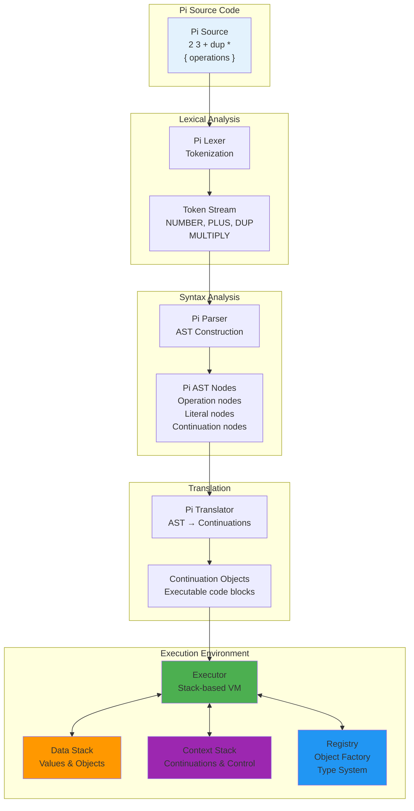
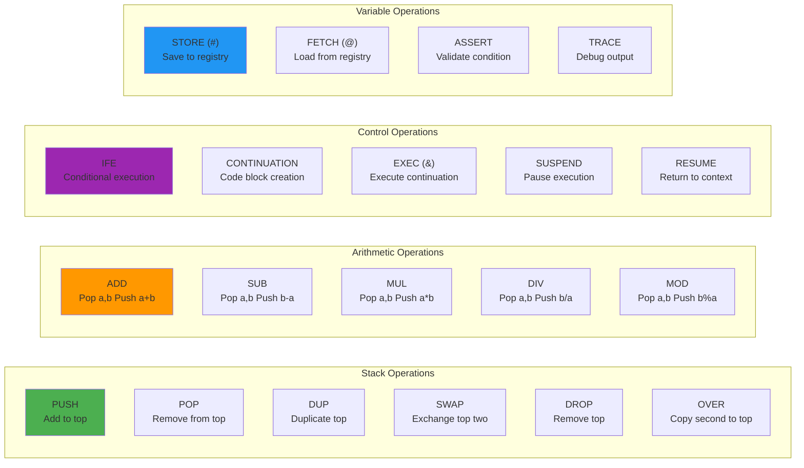

# Pi Language

Pi is a stack-based, postfix notation language that serves as the foundation of KAI's language ecosystem. Inspired by Forth, Pi provides a minimalist yet powerful programming environment where operations manipulate values on stacks rather than using traditional variables.

## Overview

Pi is the core execution language in KAI - both Rho and Tau ultimately compile down to Pi operations for execution. Understanding Pi provides deep insights into how the KAI system works at its most fundamental level.

### Key Features

- **Stack-based execution**: Operations work with data and context stacks
- **Postfix notation**: Operators follow their operands (RPN)
- **Minimal syntax**: Very few syntax rules, making it easy to parse and execute
- **Two-stack architecture**: Separate stacks for data and execution context
- **First-class continuations**: Code blocks as executable objects
- **Direct executor mapping**: Pi operations correspond directly to executor operations

## Language Architecture

**[Complete Pi Architecture Diagrams](../../../../resources/diagrams/pi-language-architecture.md)** - Comprehensive visual documentation of Pi's stack-based execution model, component relationships, and operational flow.

### Pi Stack-Based Execution Model



### Core Components

- **Pi.h**: Main language interface and utilities
- **PiLexer.h**: Tokenizes Pi source code
- **PiParser.h**: Builds abstract syntax trees from tokens  
- **PiTranslator.h**: Converts AST to executable continuations
- **PiAstNode.h**: AST node definitions for Pi constructs
- **PiToken.h**: Token type definitions
- **PiLang.h**: Language-specific constants and utilities

### Stack Model

Pi operates on two primary stacks:

1. **Data Stack**: Holds values being operated on
2. **Context Stack**: Controls program flow and stores continuations

## Basic Operations

### Pi Stack Machine Operations



### Stack Manipulation
```pi
1 2 3        // Push values: [1, 2, 3]
dup          // Duplicate top: [1, 2, 3, 3]
swap         // Swap top two: [1, 2, 3, 3]
drop         // Remove top: [1, 2, 3]
over         // Copy second to top: [1, 2, 3, 2]
```

### Arithmetic
```pi
2 3 +        // Addition: 5
10 3 -       // Subtraction: 7
4 5 *        // Multiplication: 20
15 3 div     // Division: 5
7 4 mod      // Modulo: 3
```

### Variables
```pi
42 'answer #     // Store 42 in variable 'answer'
'answer @        // Retrieve value of 'answer'
```

### Continuations
```pi
{ 2 3 + }        // Create continuation (code block)
{ 2 3 + } &      // Execute continuation: 5
{ dup * } 'square #   // Store continuation as 'square'
5 'square @ &    // Execute stored continuation: 25
```

## Documentation and Examples

### Comprehensive Tutorial
- **[Pi Tutorial](../../../../Doc/PiTutorial.md)** - Complete Pi language guide with examples

### Test Suite and Examples
- **[Pi Tests](../../../../Test/Language/TestPi/)** - Comprehensive test suite
- **[Pi Scripts](../../../../Test/Language/TestPi/Scripts/)** - Example Pi programs including:
  - Basic arithmetic and operations
  - Stack manipulation examples
  - Continuation and control flow
  - Array operations
  - String manipulation
  - Error handling patterns

### Key Example Scripts
- **[SimpleTest.pi](../../../../Test/Language/TestPi/Scripts/SimpleTest.pi)** - Basic Pi operations
- **[Continuations.pi](../../../../Test/Language/TestPi/Scripts/Continuations.pi)** - Continuation examples
- **[Array.pi](../../../../Test/Language/TestPi/Scripts/Array.pi)** - Array manipulation
- **[TutorialExample.pi](../../../../Test/Language/TestPi/Scripts/TutorialExample.pi)** - Tutorial code samples

## Integration with KAI

### Rho Integration
Pi can be embedded directly in Rho code:
```rho
result = 10 + pi{ 3 4 + }  // result = 17
```

### Console Support
Pi is the default language in the KAI Console:
```bash
$ ./Console
Pi λ 2 3 +
[0]: 5
```

### Network Transparency
Pi operations work seamlessly across network boundaries in distributed KAI systems.

## Advanced Features

### Control Flow
- Conditional execution with `ife` (if-else)
- Loop constructs using continuations
- Label/goto operations for complex control flow

### Continuation Control
- `suspend`: Pause execution and switch context
- `resume`: Return to previously suspended context  
- `replace`: Substitute current continuation

### Error Handling
- `assert`: Validate conditions during execution
- `die`: Trigger controlled program termination
- Stack trace and debugging support

## Performance Characteristics

- **Minimal overhead**: Direct mapping to executor operations
- **Stack-based efficiency**: No variable lookup overhead
- **Continuation performance**: First-class support for code objects
- **Network efficiency**: Compact serialization for distributed execution

## Development Workflow

### Running Pi Code
```bash
# Interactive mode
./Console
Pi λ 2 3 + dup *

# Script execution  
./Console script.pi

# With debugging
./Console -t 2 script.pi
```

### Testing Pi Code
```bash
# Run Pi-specific tests
./run_all_tests.sh pi

# Or specific test categories
ctest -R TestPi
```

## Best Practices

1. **Stack Discipline**: Always maintain awareness of stack state
2. **Continuation Design**: Use continuations for reusable code blocks
3. **Error Handling**: Include assertions for validation
4. **Documentation**: Comment complex stack manipulations
5. **Testing**: Validate stack effects with comprehensive tests

## See Also

- **[Language System Overview](../README.md)** - Overview of all KAI languages
- **[Rho Language](../Rho/README.md)** - Higher-level infix language that compiles to Pi
- **[Tau Language](../Tau/README.md)** - IDL for network code generation
- **[Common Language Infrastructure](../Common/README.md)** - Shared language components

## Implementation Status

- **Core Language**: Fully implemented and tested
- **Stack Operations**: Complete implementation
- **Continuations**: Full first-class support
- **Control Flow**: Advanced control structures available
- **Network Integration**: Full distributed execution support
- **Console Integration**: Complete interactive environment
- **Test Coverage**: Comprehensive test suite with 200+ test cases

Pi provides the solid foundation upon which KAI's entire language ecosystem is built, offering both simplicity and power for system-level programming and distributed computation.