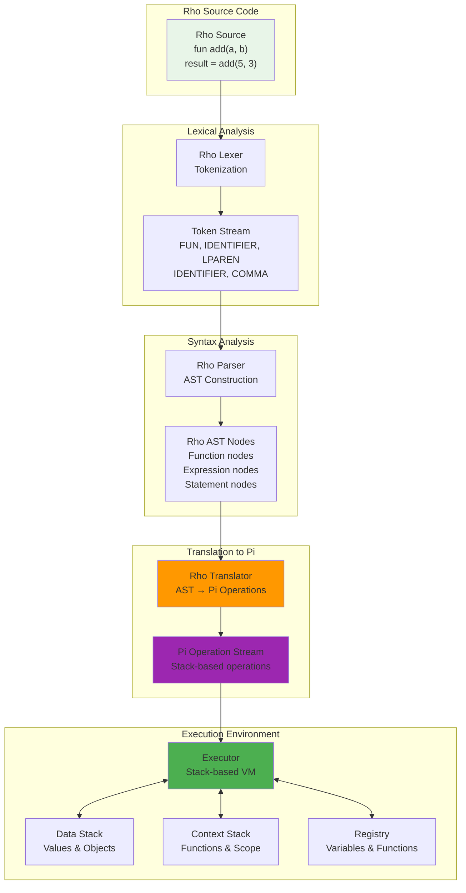
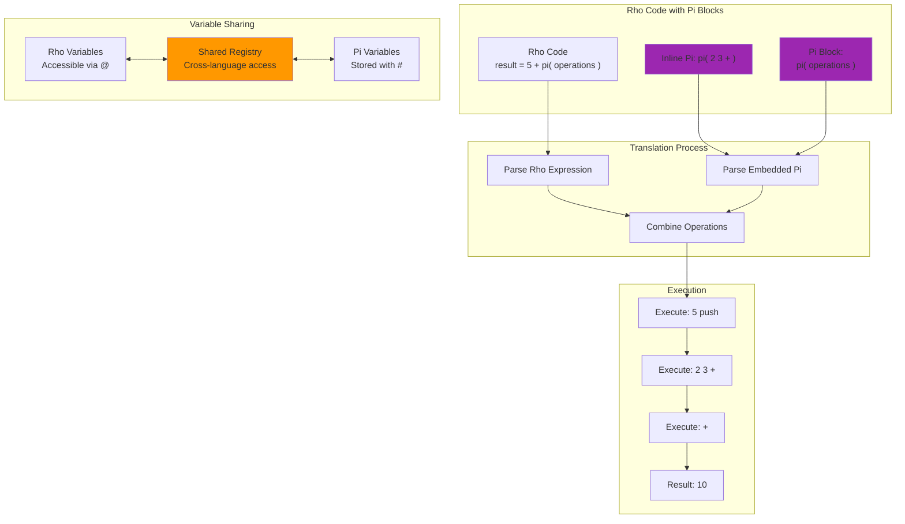

# Rho Language

Rho is an infix-notation language in the KAI system, designed to provide a familiar programming experience similar to Python, Ruby, or JavaScript. Rho compiles down to Pi operations, combining the expressiveness of modern syntax with the power of KAI's stack-based execution model.

## Overview

Rho serves as KAI's high-level programming language, offering conventional syntax while maintaining full access to Pi's capabilities and KAI's distributed object model. It's ideal for application logic, scripting, and rapid prototyping.

### Key Features

- **Infix notation**: Conventional syntax with operators between operands
- **Python-like syntax**: Familiar control structures and expressions
- **Pi integration**: Seamless embedding of Pi code within Rho expressions
- **First-class continuations**: Native support for advanced control flow
- **Strong typing**: Type safety across operations and network boundaries
- **Network transparency**: Distributed execution support

## Language Architecture

**[Complete Rho Architecture Diagrams](../../../../resources/diagrams/rho-language-architecture.md)** - Detailed visual documentation of Rho's infix language translation pipeline, expression handling, and Pi integration mechanisms.

### Rho Infix Language Translation Pipeline



### Core Components

- **Rho.h**: Main language interface and utilities
- **RhoLexer.h**: Tokenizes Rho source code into tokens
- **RhoParser.h**: Builds abstract syntax trees from token streams
- **RhoTranslator.h**: Converts AST to Pi operations for execution
- **RhoAstNode.h**: AST node definitions for Rho language constructs
- **RhoToken.h**: Token type definitions and utilities
- **RhoLang.h**: Language-specific constants and configuration

### Translation Pipeline

Rho → Lexer → Parser → AST → Translator → Pi Operations → Executor

## Basic Syntax

### Variables and Assignment
```rho
x = 42
name = "Alice"
is_valid = true

// Multiple assignments
a = b = c = 0

// Compound assignments
count += 5
count -= 3
count *= 2
count /= 4
```

### Control Structures
```rho
// Conditionals
if (x > 10) {
    print("Greater than 10")
} else {
    print("10 or less")
}

// Loops
while (count < 10) {
    count = count + 1
}

for (i = 0; i < 10; i = i + 1) {
    sum = sum + i
}
```

### Functions
```rho
fun add(a, b) {
    return a + b
}

result = add(5, 3)  // 8
```

## Documentation and Examples

### Comprehensive Tutorial
- **[Rho Tutorial](../../../../Doc/RhoTutorial.md)** - Complete Rho language guide with examples

### Test Suite and Examples  
- **[Rho Tests](../../../../Test/Language/TestRho/)** - Extensive test suite with 100+ test files
- **[Rho Scripts](../../../../Test/Language/TestRho/Scripts/)** - Example Rho programs including:
  - Basic operations and arithmetic
  - Control flow and loops
  - Function definitions and calls
  - Object-oriented patterns
  - Pi integration examples
  - Advanced language features

### Key Example Scripts
- **[BasicTest.rho](../../../../Test/Language/TestRho/Scripts/BasicTest.rho)** - Fundamental Rho operations
- **[Function.rho](../../../../Test/Language/TestRho/Scripts/Function.rho)** - Function definition examples
- **[Conditional.rho](../../../../Test/Language/TestRho/Scripts/Conditional.rho)** - Control flow patterns
- **[TutorialExample.rho](../../../../Test/Language/TestRho/Scripts/TutorialExample.rho)** - Tutorial code samples
- **[PiBlockTest.rho](../../../../Test/Language/TestRho/Scripts/PiBlockTest.rho)** - Pi integration examples

## Pi Integration

### Rho-Pi Integration Architecture



One of Rho's most powerful features is seamless Pi integration:

```rho
// Inline Pi expressions
result = 5 + pi{ 2 3 + }  // result = 10

// Pi code blocks
pi{
    1 2 3 + +    // Calculate 1 + 2 + 3
    'sum #       // Store in variable 'sum'
}

// Access Pi variables
total = sum @    // Retrieve Pi variable value
```

## Integration with KAI

### Console Support
```bash
# Start in Rho mode
$ ./Console -l rho
Rho λ x = 5 + 3
[0]: 8

# Switch languages in console
Pi λ rho
Rho λ 
```

### Network Programming
```rho
// Network node creation and communication
node = Network.CreateNode()
node.Connect("192.168.1.100", 8080)

// Distributed computation
result = node.RemoteExecute("calculateSum", [1, 2, 3, 4, 5])
```

### KAI Object System
```rho
// Access KAI registry
registry = System.Registry

// Create KAI objects
vector = registry.New("Vector3", 1.0, 2.0, 3.0)
normalized = vector.Normalize()
```

## Advanced Features

### Anonymous Functions and Closures
```rho
// Anonymous functions
square = fun(x) { return x * x }

// Function as arguments
numbers = [1, 2, 3, 4, 5]
squared = map(numbers, fun(x) { return x * 2 })
```

### Continuations
```rho
// Creating continuations
cont = {
    x = 10
    y = 20
    x + y
}

result = cont()  // 30
```

### Object-Oriented Patterns
```rho
// Constructor pattern
fun createPerson(name, age) {
    return {
        "name": name,
        "age": age,
        "greet": fun() { 
            return "Hello, " + name 
        }
    }
}

person = createPerson("Alice", 30)
greeting = person["greet"]()
```

## Development Workflow

### Running Rho Code
```bash
# Interactive mode
./Console -l rho
Rho λ x = 5 * 3

# Script execution
./Console script.rho

# With debugging
./Console -t 2 script.rho
```

### Testing Rho Code
```bash
# Run Rho-specific tests
./run_all_tests.sh rho

# Or specific test categories
ctest -R TestRho

# Run specific test script
./Console Test/Language/TestRho/Scripts/BasicTest.rho
```

## Language Status

### Fully Implemented Features
- **Basic syntax**: Variables, operators, expressions
- **Control flow**: if/else, while, for, do-while loops
- **Functions**: Definition, calls, parameters, return values
- **Pi integration**: Inline Pi blocks and variable access
- **Arrays**: Creation, indexing, basic operations
- **Comments**: Single-line and block comments

### Advanced Features
- **Continuations**: First-class continuation support
- **Scoping**: Lexical scoping with proper variable resolution
- **Type system**: Dynamic typing with type checking
- **Error handling**: Exception propagation and handling
- **Network integration**: Distributed execution capabilities

### Test Coverage
- **200+ test cases** covering all language features
- **Comprehensive script library** with real-world examples
- **Continuous integration** ensuring language stability
- **Performance benchmarks** validating execution efficiency

## Performance Characteristics

- **Compilation speed**: Fast translation to Pi operations
- **Runtime efficiency**: Leverages Pi's optimized stack execution
- **Memory usage**: Efficient memory management through KAI's GC
- **Network performance**: Optimized serialization for distributed execution

## Best Practices

1. **Readable code**: Use meaningful variable and function names
2. **Consistent style**: Follow consistent indentation and formatting
3. **Error handling**: Use assertions and proper error checking
4. **Modular design**: Break code into reusable functions
5. **Pi integration**: Use Pi judiciously for performance-critical sections
6. **Testing**: Write comprehensive tests for all functionality

## Common Patterns

### Error Handling
```rho
assert(x > 0, "x must be positive")

// Validation patterns
if (!isValid(input)) {
    System.Error("Invalid input: " + input)
    return false
}
```

### Iteration Patterns
```rho
// Array processing
for (i = 0; i < array.Count; i = i + 1) {
    process(array[i])
}

// Accumulation
sum = 0
for (i = 0; i < values.Count; i = i + 1) {
    sum = sum + values[i]
}
```

### Function Composition
```rho
// Higher-order functions
fun compose(f, g) {
    return fun(x) { return f(g(x)) }
}

addThenSquare = compose(square, add5)
result = addThenSquare(3)  // (3 + 5)^2 = 64
```

## See Also

- **[Language System Overview](../README.md)** - Overview of all KAI languages
- **[Pi Language](../Pi/README.md)** - Stack-based foundation language
- **[Tau Language](../Tau/README.md)** - IDL for network code generation
- **[Common Language Infrastructure](../Common/README.md)** - Shared language components

## Real-World Applications

Rho is particularly well-suited for:

1. **Application logic**: Business logic and user interfaces
2. **Scripting**: Configuration and automation scripts
3. **Rapid prototyping**: Quick implementation and testing of ideas
4. **Network programming**: Distributed system coordination
5. **System integration**: Glue code between different components
6. **Educational purposes**: Teaching programming concepts

Rho provides the perfect balance between familiarity and power, making KAI's advanced capabilities accessible to developers while maintaining the full expressiveness of the underlying system.