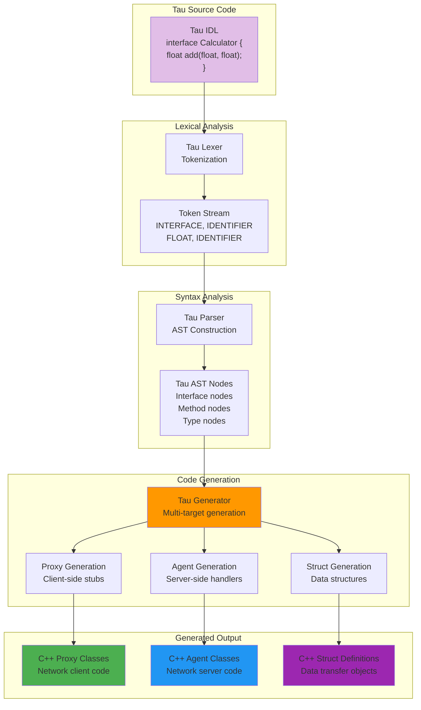
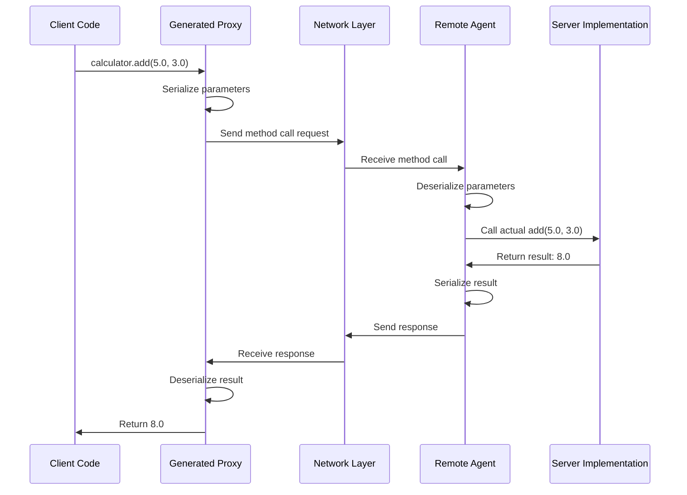

# Tau

Tau is KAI's Interface Definition Language (IDL), designed for describing networked objects, interfaces, and services within the KAI distributed object model. It provides a way to define how components communicate across the network.

**[Complete Tau Architecture Diagrams](../../../../Doc/TauArchitectureDiagrams.md)** - Complete visual documentation of Tau's IDL processing pipeline, multi-target code generation, and network integration architecture with detailed Mermaid diagrams.

### Tau Interface Definition Language Pipeline



## Key Features

- **Interface-focused**: Defines the public interfaces of networked objects
- **Network-oriented**: Designed for cross-network communication
- **Type-safe**: Ensures type compatibility across network boundaries
- **Declarative**: Focuses on what rather than how

## Syntax Overview

Tau uses the same lexing and parsing systems as the interpreted languages Pi and Rho. **Unlike** those systems, Tau is an Interface Definition Language. The input is `.tau` files; the output is C++ files for:

1. Proxies - Client-side interfaces that forward calls to remote agents
2. Agents - Server-side implementations that receive and process remote calls

### Example

```tau
namespace Trading {
    // Define an interface
    interface ITrader {
        // Method definitions
        bool PlaceOrder(string symbol, int quantity, float price);
        void CancelOrder(string orderId);
        
        // Define an event
        event OrderPlaced(string symbol, int quantity, float price);
    }
}
```

### Tau Proxy Generation Pattern



## Recent Enhancements

- Support for C++17 nested namespace syntax (`namespace A::B::C`)
- Support for interface inheritance hierarchies
- Improved event handling with callback registration
- Enhanced type system with enums, structs, and complex types
- Better error reporting during parsing and code generation

## Usage

To generate code from Tau definitions, use the NetworkGenerate application:

```
NetworkGenerate --input=MyInterface.tau --output=GeneratedCode --proxy --agent
```

For detailed usage instructions and syntax guide, see:
1. [Tau Tutorial](../../../Doc/TauTutorial.md) for comprehensive documentation
2. [App/NetworkGenerate](../../../Source/App/NetworkGenerate) for the code generation tool

## Testing

Extensive test suites are available to demonstrate Tau's capabilities:
- Basic syntax and parsing tests
- Advanced type system tests
- Code generation tests for proxies and agents