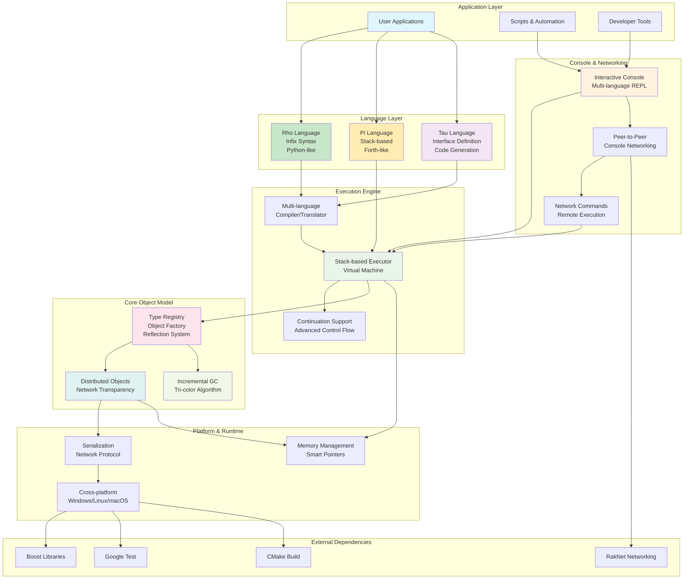

# KAI - Distributed Object Model for C++ 

[](https://ci.appveyor.com/project/cschladetsch/kai)
[](https://www.codefactor.io/repository/github/cschladetsch/kai)
[](./LICENSE)

_KAI_ is a network distributed **Object Model** for C++ with full runtime reflection, persistence, and incremental garbage collection. No macros are needed to expose fields or methods to the scripting runtime, including external code from other libraries.

Objects and *compute* can be distributed across Nodes in a Domain.

## System Architecture Overview

The KAI system provides a multi-layered architecture that enables distributed object programming with multiple language frontends:



### Key System Components

- **Multi-Language Frontend**: Rho (infix), Pi (stack-based), and Tau (IDL) languages with seamless interoperability
- **Interactive Console**: Real-time REPL with peer-to-peer networking capabilities  
- **Distributed Object Model**: Network-transparent objects with type safety across node boundaries
- **Stack-based Execution**: High-performance virtual machine with continuation support
- **Incremental Garbage Collection**: Smooth memory management without performance spikes
- **Code Generation**: Tau IDL generates proxy/agent pairs for network communication
- **Cross-platform Support**: Unified development experience across major operating systems

## Demo Views

[Pi](Doc/PiTutorial.md) is a postfix language. 


`Window` illustrates how **Rho** is transpiled to **Pi**. I should make an animated gif of this. But here's a screenshot in the interim. By the way, just using the **Pi* tab is effectively like using the **Console** but has a debugger:


## Documentation & Architecture

### **Main Documentation Hub**
**[Documentation Guide](Doc/Documentation.md)** - Start here for organized navigation of all documentation | **[Doc/ README](Doc/README.md)**

### **System Architecture** 
**[Architecture Resources](resources/README.md)** - Comprehensive system architecture documentation and diagrams
- **[Overall System Architecture](resources/diagrams/overall-system-architecture.md)** - High-level component relationships and data flow
- **[Language System Architecture](resources/diagrams/language-system-architecture.md)** - Pi/Rho/Tau translation pipeline and interoperability
- **[Console Networking Architecture](resources/diagrams/console-networking-architecture.md)** - P2P communication model and protocols
- **[Build System Architecture](resources/diagrams/build-system-architecture.md)** - CMake structure and dependencies
- **[Test System Architecture](resources/diagrams/test-system-architecture.md)** - Test infrastructure and validation workflows
- **[System Overview](resources/architecture/system-overview.md)** - Complete architectural analysis with statistics

### **Development Guides**
- **Building**: [Build Guide](Doc/OUT_OF_SOURCE_BUILD.md) | [Installation](Doc/Install.md) | [CMake Guide](CMake/README.md)
- **Languages**: [Pi Tutorial](Doc/PiTutorial.md) | [Rho Tutorial](Doc/RhoTutorial.md) | [Tau Tutorial](Doc/TauTutorial.md) | [Language System](Include/KAI/Language/README.md)
- **Networking**: [Overview](Doc/Networking.md) | [Architecture](Doc/NetworkArchitecture.md) | [Console Networking](CONSOLE_NETWORKING.md)
- **Testing**: [Test Guide](Doc/Test.md) | [Connection Testing](Doc/ConnectionTesting.md) | [Test Overview](Test/README.md)
- **Code Generation**: [Tau Code Generation](Doc/TauCodeGeneration.md) | [Tau Generate](Include/KAI/Language/Tau/Generate/README.md)
- **Project Status**: [TODO](TODO.md) | [Test Summary](TEST_SUMMARY.md)

### **Component Documentation**
- **Core System**: [Core README](Include/KAI/Core/README.md) | [Registry](Include/KAI/Core/Object/README.md) | [Config](Include/KAI/Core/Config/README.md)
- **Executor**: [Executor README](Include/KAI/Executor/README.md) - Virtual machine and execution engine
- **Console**: [Console README](Include/KAI/Console/README.md) - Interactive shell with networking
- **Languages**: [Common](Include/KAI/Language/Common/README.md) | [Pi](Include/KAI/Language/Pi/README.md) | [Rho](Include/KAI/Language/Rho/README.md) | [Tau](Include/KAI/Language/Tau/README.md)
- **Platform Support**: [Platforms](Include/KAI/Platform/README.md) | [Linux](Include/KAI/Platform/Linux/README.md) | [Windows](Include/KAI/Platform/Windows/README.md) | [macOS](Include/KAI/Platform/OSX/README.md)

### **Testing & Examples**
- **Test Suites**: [Test Overview](Test/README.md) | [Language Tests](Test/Language/README.md) | [Console Tests](Test/Console/README.md) | [Network Tests](Test/Network/README.md)
- **Example Code**: [Examples](Examples/README.md) - Sample applications and use cases
- **Scripts**: [Scripts](Scripts/README.md) - Build and demo scripts

### **External Dependencies**
- **External Libraries**: [Ext/](Ext/README.md) - Third-party dependencies and libraries
- **Build System**: [CMake](CMake/README.md) - Build configuration and macros

### **Quick Start Examples**

- Run `./Scripts/run_rho_demo.sh` for a comprehensive demo of Rho language features
- Run `./Scripts/calc_test.sh` for a demonstration of network calculation
- Run `./demo_console_communication.sh` for interactive console-to-console networking demo
- Example scripts in `Test/Language/*/Scripts` directories

## Key Features

- **Zero-Macro Reflection**: Expose C++ types and methods to scripting without macros or source modifications
- **Distributed Computing**: Share both data and computation across networked nodes
- **Console Networking**: Real-time console-to-console communication with command sharing
- **Multiple Languages**: Use Pi (stack-based), Rho (infix), or Tau (IDL) as needed
- **Type Safety**: Full type checking across network boundaries
- **Incremental GC**: Smooth, constant-time garbage collection with no spikes
- **Cross-Platform**: Works on Windows, Linux, macOS, and Unity3D
- **Network Transparency**: Access remote objects as if they were local
- **Dynamic Load Balancing**: Automatically distribute workload across network nodes

## Core Components

- **Registry**: Type-safe object factory for creating, managing, and reflecting C++ objects
- **Domain**: A collection of registries across network nodes
- **Executor**: Stack-based virtual machine for executing code
- **Memory Management**: Incremental tri-color garbage collector

### Languages

- **Pi**: Stack-based RPN language inspired by Forth
- **Rho**: Python-like infix language that compiles to Pi (fully functional with all tests passing)
- **Tau**: Interface Definition Language (IDL) for network components

### Console Networking

KAI consoles can communicate with each other over the network in real-time:

```bash
# Console 1 (Server)
./console
pi> /network start 14600
pi> 2 3 +

# Console 2 (Client)
./console
pi> /network start 14601
pi> /connect localhost 14600
pi> /@0 10 *              # Multiply Console 1's result by 10
pi> /broadcast stack      # Show stack on all connected consoles
```

**Network Commands:**
- `/network start [port]` - Enable networking
- `/connect <host> <port>` - Connect to peer console
- `/@<peer> <command>` - Execute command on specific peer
- `/broadcast <command>` - Execute command on all peers
- `/peers` - List connected consoles

See [Console Networking Guide](CONSOLE_NETWORKING.md) for complete documentation.

## Example Code

See [Documentation Guide](Doc/Languages.md).

### Pi (Stack-based)

```pi
{ dup * } 'square #  // Define a function that squares its input
5 square @           // Retrieve the function
&                    // Execute the function
```

### Rho (Infix)

```rho
fun square(x) {
    return x * x
}
result = square(5)  // result is 25
```

### Distributed Computing

```rho
// Create a network node
node = createNetworkNode()
node.listen(14589)
node.connect("192.168.1.10", 14589)

// Create data and define a function
data = [1, 2, 3, 4, 5, 6, 7, 8, 9, 10]
fun square(x) { return x * x }

// Process the data using distributed execution
result = acrossAllNodes(node, data, square)
print(result)  // [1, 4, 9, 16, 25, 36, 49, 64, 81, 100]
```

## Getting Started

### Prerequisites

- Modern C++ compiler (C++23 compatible)
  - Clang 16+ (default, recommended)
  - GCC 13+
  - MSVC 2022+
- CMake (3.28+)
- Boost libraries (filesystem, system, program_options, date-time, regex)
- Ninja (optional but recommended for faster builds)

### Building

Clone the repository with submodules:
```bash
git clone https://github.com/cschladetsch/KAI.git
cd KAI
git submodule init
git submodule update
```

#### Using the Build Scripts

Build scripts that follow best practices for out-of-source builds:

```bash
# Quick build (using Clang++ by default)
./b

# Build with GCC
./b --gcc

# Build without Ninja
./b --no-ninja

# Using Makefile (Clang++ by default)
make

# Using Makefile with GCC
make gcc

# Clean build directory
make clean
```

#### Manual Build (Out-of-Source)

For a manual build, always use the `build/` directory:

```bash
# Create build directory
mkdir -p build
cd build

# Configure with CMake (Clang++ by default)
cmake ..

# Configure with GCC
cmake .. -DBUILD_GCC=ON

# Build the project
cmake --build .   # Cross-platform
# or
make              # Unix systems
# or
ninja             # If using Ninja generator
```

For more detailed build instructions, see [BUILD.md](Doc/BUILD.md).

### Security Configuration

Shell operations (backtick syntax) are disabled by default for security. To enable:
```bash
# Enable shell syntax during build
cmake .. -DENABLE_SHELL_SYNTAX=ON

# Or with the build script
./b --enable-shell
```

## Applications

### Console
The interactive console provides a professional REPL environment with comprehensive features:

```bash
# Show help and options
$ ./Console --help
$ ./Console --version

# Start in different modes
$ ./Console                    # Interactive Pi mode (default)
$ ./Console -l rho             # Interactive Rho mode
$ ./Console script.pi          # Execute Pi script
$ ./Console -t 2 script.rho    # Execute with trace level 2
$ ./Console --verbose          # Enable verbose output
```

**Interactive Session Example:**
```
$ ./Console
KAI Console v0.3.0
Built on Jun 21 2025 at 23:47:34
Type 'help' for available commands.

Pi λ help
KAI Console Help

Available help topics:
  help basics     - Basic usage and commands
  help history    - History and command expansion
  help shell      - Shell integration
  help languages  - Pi and Rho language features

Language-specific help:
  help pi         - Pi language reference
  help rho        - Rho language reference

Built-in Commands:
  help [topic]    - Show help (optionally for specific topic)
  clear, cls      - Clear screen
  exit, quit      - Exit console
  pi, rho         - Switch language mode
  history         - Show command history
  stack           - Show current stack
  $ <command>     - Execute shell command

Pi λ 2 3 +
[0]: 5

Pi λ history
Command History:
  1: 2 3 +

Pi λ rho
Switched to Rho language mode

Rho λ x = 42; y = x * 2; y
[0]: 84
```

**Professional Features:**
- **Command-Line Interface**: Full argument parsing with `--help`, `--version`, language selection, trace levels
- **Interactive Help System**: Context-sensitive help with topics (`help pi`, `help rho`, `help shell`)
- **Persistent History**: Commands automatically saved to `~/.kai_history` across sessions
- **Built-in Commands**: `help`, `clear`, `history`, `stack`, `exit`, language switching
- **Shell Integration**: Execute shell commands with `$ command` (when enabled with ENABLE_SHELL_SYNTAX)
- **Backtick Expansion**: Embed shell output in expressions: `` `echo 42` 10 + ``
- **Enhanced Display**: Color-coded stack with orange-colored numbers for better visibility
- **Error Handling**: User-friendly error messages with suggestions
- **Auto-installation**: Copies to `~/bin` if directory exists

**Security:**
- Shell operations disabled by default for safety
- Enable with `-DENABLE_SHELL_SYNTAX=ON` during build

See [Console Documentation](Doc/Console.md) for comprehensive usage guide.

### Network Applications
The system includes several network applications:

```bash
# Run a configurable calculation server
./build/Bin/ConfigurableServer config/server_config.json

# Run a client that sends a calculation request
./build/Bin/ConfigurableClient config/client_config.json
```

Try the calculation test demo:
```bash
./Scripts/calc_test.sh
```

### GUI Application
The GUI application provides:
- Syntax highlighted code editing
- Visual stack inspection
- Network monitoring
- Object browser
- Performance metrics


## Project Structure

- **Bin**: Executable output files
- **build**: Build directory (for all build artifacts)
- **CMake**: Auxiliary CMake modules
- **Doc**: Documentation and tutorials
- **Ext**: External dependencies (git submodules)
- **Include**: Global include path
- **Lib**: Library files
- **Logs**: System logs (ignored by git)
- **Source**: Project source code
- **Test**: Unit tests

### Tau Language Module Architecture

The Tau language module has a well-organized structure for code generation:

#### Code Generation Classes (`Include/KAI/Language/Tau/Generate/`)

- **GenerateProcess**: Base class for all code generators, providing common functionality
- **GenerateProxy**: Generates client-side proxy classes for remote procedure calls
- **GenerateAgent**: Generates server-side agent classes for handling incoming requests  
- **GenerateStruct**: Generates plain data structure definitions

All generators properly inherit from `GenerateProcess` and have clear separation of concerns:

1. **Proxy Generation** - Creates proxy classes that forward method calls over the network
2. **Agent Generation** - Creates agent classes that receive and process network requests
3. **Struct Generation** - Creates plain C++ struct definitions from Tau IDL

#### Source Organization

**Headers** (`Include/KAI/Language/Tau/`):
- Core components: `Tau.h`, `TauLexer.h`, `TauParser.h`, `TauToken.h`, `TauAstNode.h`
- Configuration: `Config.h`
- Code generation: `Generate/` subdirectory

**Implementation** (`Source/Library/Language/Tau/Source/`):
- `Tau/` - Core language implementation
- `Generate/` - Code generation implementations

**Tests** (`Test/Language/TestTau/`):
- Comprehensive test suite including `TauGenerateStructTests.cpp` and `TauSeparateGenerationTests.cpp`

This architecture enables clean separation between:
- Interface definitions (Tau IDL)
- Client-side proxy code (for making remote calls)
- Server-side agent code (for handling remote calls)
- Plain data structures (for data transfer objects)

## Platforms

- Windows 10/11 (VS 2017-22)
- Linux (Ubuntu, Debian)
- macOS (Sierra and newer)
- Unity3D (2017+)

## License

This project is licensed under the MIT License - see the [LICENSE](LICENSE) file for details.

---

## Complete Project Navigation

### **Architecture & Design**
- **[Architecture Overview](resources/README.md)** - Complete system architecture with professional diagrams
- **[System Diagrams](resources/diagrams/)** - Visual architecture documentation using Mermaid
- **[System Analysis](resources/architecture/system-overview.md)** - Detailed technical analysis and statistics

### **Core Documentation** (71 README files)
- **[Main Documentation](Doc/README.md)** - Central documentation hub
- **[All Documentation Files](Doc/)** - Tutorials, guides, and technical references

### **System Components**
- **[Core System](Include/KAI/Core/README.md)** - Registry, objects, memory management
- **[Executor](Include/KAI/Executor/README.md)** - Virtual machine and execution engine  
- **[Console](Include/KAI/Console/README.md)** - Interactive shell with networking
- **[Language System](Include/KAI/Language/README.md)** - Pi, Rho, Tau implementation
- **[Networking](CONSOLE_NETWORKING.md)** - P2P console communication

### **Source Code Structure**
- **[Include Headers](Include/KAI/README.md)** - All public API headers and interfaces
- **[Source Code](Source/README.md)** - Implementation files and libraries
- **[Applications](Source/App/README.md)** - Console, Window, and network applications

### **Testing & Quality**
- **[Test Overview](Test/README.md)** - Complete test suite documentation
- **[Language Tests](Test/Language/README.md)** - Pi, Rho, Tau validation
- **[Network Tests](Test/Network/README.md)** - P2P communication testing
- **[Scripts](Scripts/README.md)** - Build, test, and demo scripts

### **Development Tools**
- **[Build System](CMake/README.md)** - CMake configuration and build tools
- **[Dependencies](Ext/README.md)** - External libraries and third-party code
- **[Examples](Examples/README.md)** - Sample code and usage examples

### **Platform Support**
- **[All Platforms](Include/KAI/Platform/README.md)** - Cross-platform support overview
- **[Linux](Include/KAI/Platform/Linux/README.md)** - Linux-specific documentation
- **[Windows](Include/KAI/Platform/Windows/README.md)** - Windows support and configuration
- **[macOS](Include/KAI/Platform/OSX/README.md)** - macOS development setup

### **Project Statistics**
- **629** C++ source files
- **71** README documentation files  
- **200+** comprehensive test cases
- **5** complete architecture diagram sets
- **3** integrated programming languages (Pi/Rho/Tau)
- **Full** console-to-console networking implementation

**Start exploring**: Begin with the **[Documentation Guide](Doc/Documentation.md)** or dive into **[System Architecture](resources/README.md)** for technical details.
