# NetworkGenerate - Tau IDL Code Generator

NetworkGenerate is KAI's command-line tool for generating C++ network code from Tau Interface Definition Language (IDL) files. It transforms Tau interfaces into type-safe, network-transparent proxy and agent classes for distributed computing.

## Overview

NetworkGenerate processes `.tau` files and generates C++ code for:

- **Proxy Classes** - Client-side stubs that forward method calls over the network
- **Agent Classes** - Server-side handlers that receive and process remote calls  
- **Struct Definitions** - Data transfer objects for network communication

### NetworkGenerate Workflow

```mermaid
flowchart TB
    subgraph "Input"
        TAU_FILE["📄 Input TAU File<br/>Calculator.tau<br/><pre><code>interface ICalculator {<br/>  float add(float a, float b);<br/>  event ResultReady(float);<br/>}</code></pre>"]
        CMD_ARGS["⚙️ Command Line Arguments<br/>--out=./generated<br/>--proxy_dir=./client<br/>--agent_dir=./server"]
    end
    
    subgraph "NetworkGenerate Processing"
        VALIDATE["✅ Validate Input<br/>• File exists<br/>• Readable format<br/>• Valid Tau syntax"]
        
        PARSE["🌳 Parse TAU File<br/>• TauLexer tokenization<br/>• TauParser AST construction<br/>• Syntax validation"]
        
        subgraph "Code Generation"
            GEN_PROXY["🔄 Generate Proxy<br/>• Client-side stubs<br/>• Method call forwarding<br/>• Event registration<br/>• Error handling"]
            GEN_AGENT["🏠 Generate Agent<br/>• Server-side handlers<br/>• Request processing<br/>• Event triggering<br/>• Implementation stubs"]
            GEN_STRUCT["📋 Generate Structs<br/>• Data definitions<br/>• Serialization code<br/>• Type safety"]
        end
        
        FORMAT["📝 Format Output<br/>• Header guards<br/>• Include statements<br/>• Namespace wrapping<br/>• Documentation"]
    end
    
    subgraph "Output Files"
        PROXY_FILE["📁 Calculator.proxy.h<br/>• ICalculatorProxy class<br/>• Network method calls<br/>• Event handlers<br/>• Error handling"]
        AGENT_FILE["📁 Calculator.agent.h<br/>• ICalculatorAgent class<br/>• Request handlers<br/>• Event triggers<br/>• Implementation interface"]
        STRUCT_FILE["📁 Calculator.structs.h<br/>• Data structures<br/>• Serialization methods<br/>• Type definitions"]
    end
    
    subgraph "Integration"
        CLIENT_APP["👤 Client Application<br/>Links Calculator.proxy.h<br/>Calls remote methods<br/>Handles events"]
        SERVER_APP["🏠 Server Application<br/>Links Calculator.agent.h<br/>Implements handlers<br/>Triggers events"]
        NETWORK["🌐 Network Layer<br/>RakNet BitStreams<br/>Message routing<br/>Connection management"]
    end
    
    TAU_FILE --> VALIDATE
    CMD_ARGS --> VALIDATE
    VALIDATE --> PARSE
    PARSE --> GEN_PROXY
    PARSE --> GEN_AGENT
    PARSE --> GEN_STRUCT
    GEN_PROXY --> FORMAT
    GEN_AGENT --> FORMAT
    GEN_STRUCT --> FORMAT
    FORMAT --> PROXY_FILE
    FORMAT --> AGENT_FILE
    FORMAT --> STRUCT_FILE
    
    PROXY_FILE --> CLIENT_APP
    AGENT_FILE --> SERVER_APP
    STRUCT_FILE --> CLIENT_APP
    STRUCT_FILE --> SERVER_APP
    CLIENT_APP --> NETWORK
    SERVER_APP --> NETWORK
    
    style TAU_FILE fill:#e1bee7,stroke:#333,stroke-width:2px
    style VALIDATE fill:#4caf50,stroke:#333,stroke-width:2px
    style PARSE fill:#2196f3,stroke:#333,stroke-width:2px
    style GEN_PROXY fill:#4caf50,stroke:#333,stroke-width:2px
    style GEN_AGENT fill:#2196f3,stroke:#333,stroke-width:2px
    style GEN_STRUCT fill:#9c27b0,stroke:#333,stroke-width:2px
    style PROXY_FILE fill:#4caf50,stroke:#333,stroke-width:2px
    style AGENT_FILE fill:#2196f3,stroke:#333,stroke-width:2px
    style STRUCT_FILE fill:#9c27b0,stroke:#333,stroke-width:2px
    style NETWORK fill:#f44336,stroke:#333,stroke-width:2px
```



### Generated Code Integration


## Usage

### Basic Usage

```bash
# Generate both proxy and agent classes
./NetworkGenerate input.tau

# Specify output directory
./NetworkGenerate input.tau --out=/path/to/output

# Generate only proxy classes
./NetworkGenerate input.tau --proxy_dir=./proxies --agent_dir=""
```

### Command-Line Options

```
Options:
  --help                Show help message
  --input <file>        Input TAU file (required)
  --out <dir>           Set output directory for both proxy and agent (default: ".")
  --proxy_dir <dir>     Set output directory for proxy files (default: ".")
  --agent_dir <dir>     Set output directory for agent files (default: ".")
  --proxy_name <format> Set output filename format for proxy (default: "%s.proxy.h")
  --agent_name <format> Set output filename format for agent (default: "%s.agent.h")
  --start <file>        File included before anything else
  --pre <file>          File included after start and before definition
  --post <file>         File included after definition
```

### Filename Formatting

The `--proxy_name` and `--agent_name` options support format strings where `%s` is replaced with the input filename (without extension):

```bash
# Generate Calculator.proxy.h and Calculator.agent.h
./NetworkGenerate Calculator.tau

# Generate CalcProxy.h and CalcAgent.h  
./NetworkGenerate Calculator.tau --proxy_name="CalcProxy.h" --agent_name="CalcAgent.h"

# Generate Calc_Proxy.cpp and Calc_Agent.cpp
./NetworkGenerate Calculator.tau --proxy_name="%s_Proxy.cpp" --agent_name="%s_Agent.cpp"
```

## Example Workflow

### 1. Create a Tau Interface Definition

**Calculator.tau:**
```tau
namespace MathService {
    interface ICalculator {
        float add(float a, float b);
        float subtract(float a, float b);
        float multiply(float a, float b);
        float divide(float a, float b);
        
        event CalculationCompleted(string operation, float result);
    }
}
```

### 2. Generate C++ Code

```bash
./NetworkGenerate Calculator.tau --out=./generated
```

### 3. Generated Files

**Calculator.proxy.h** - Client-side proxy:
```cpp
namespace MathService {
    class ICalculatorProxy {
    public:
        float add(float a, float b);
        float subtract(float a, float b);
        float multiply(float a, float b);
        float divide(float a, float b);
        
        void RegisterCalculationCompletedHandler(
            std::function<void(string, float)> handler);
    };
}
```

**Calculator.agent.h** - Server-side agent:
```cpp
namespace MathService {
    class ICalculatorAgent {
    public:
        void HandleAdd(BitStream& params, BitStream& response);
        void HandleSubtract(BitStream& params, BitStream& response);
        void HandleMultiply(BitStream& params, BitStream& response);
        void HandleDivide(BitStream& params, BitStream& response);
        
        void TriggerCalculationCompleted(string operation, float result);
    };
}
```

## Advanced Features

### Custom Include Files

Use `--start`, `--pre`, and `--post` to customize generated code:

```bash
./NetworkGenerate Calculator.tau \
  --start=copyright.h \
  --pre=common_includes.h \
  --post=cleanup.h
```

### Separate Output Directories

Generate proxies and agents to different directories:

```bash
./NetworkGenerate Calculator.tau \
  --proxy_dir=./client/generated \
  --agent_dir=./server/generated
```

### Integration with Build Systems

**CMake integration:**
```cmake
# Add custom command to generate network code
add_custom_command(
    OUTPUT ${CMAKE_CURRENT_BINARY_DIR}/Calculator.proxy.h
           ${CMAKE_CURRENT_BINARY_DIR}/Calculator.agent.h
    COMMAND NetworkGenerate
    ARGS ${CMAKE_CURRENT_SOURCE_DIR}/Calculator.tau
         --out=${CMAKE_CURRENT_BINARY_DIR}
    DEPENDS ${CMAKE_CURRENT_SOURCE_DIR}/Calculator.tau
    COMMENT "Generating network code from Calculator.tau"
)
```

## Error Handling

NetworkGenerate provides detailed error messages for common issues:

```bash
# Missing input file
$ ./NetworkGenerate
Options:
  --help                Show help message
  ...

# Parse errors
$ ./NetworkGenerate invalid.tau
ProxyGenError: Parse error at line 5: Expected ';' after method declaration

# File access errors  
$ ./NetworkGenerate Calculator.tau --out=/readonly/dir
Error: Could not open /readonly/dir/Calculator.proxy.h for writing
```

## Integration with KAI System

Generated proxy and agent classes integrate seamlessly with the KAI distributed object model:

- **Type Safety** - Full C++ type checking across network boundaries
- **Serialization** - Automatic parameter serialization using RakNet BitStreams
- **Event Handling** - Callback registration for distributed events
- **Network Transparency** - Remote objects appear as local C++ objects

## Supported Tau Features

NetworkGenerate supports the full Tau IDL specification:

- ✅ Interfaces with methods and events
- ✅ Nested namespaces (`namespace A::B::C`)
- ✅ Complex parameter types (structs, arrays, enums)
- ✅ Default parameter values
- ✅ Interface inheritance
- ✅ Generic/template interfaces
- ✅ Async method declarations

## See Also

- **[Tau Tutorial](../../../Doc/TauTutorial.md)** - Complete Tau IDL language guide
- **[Tau Code Generation](../../../Doc/TauCodeGeneration.md)** - Code generation architecture
- **[Tau README](../../../Include/KAI/Language/Tau/README.md)** - Language overview
- **[Generate README](../../../Include/KAI/Language/Tau/Generate/README.md)** - Code generation details
- **[Test Examples](../../../Test/Language/TestTau/)** - Comprehensive test cases


