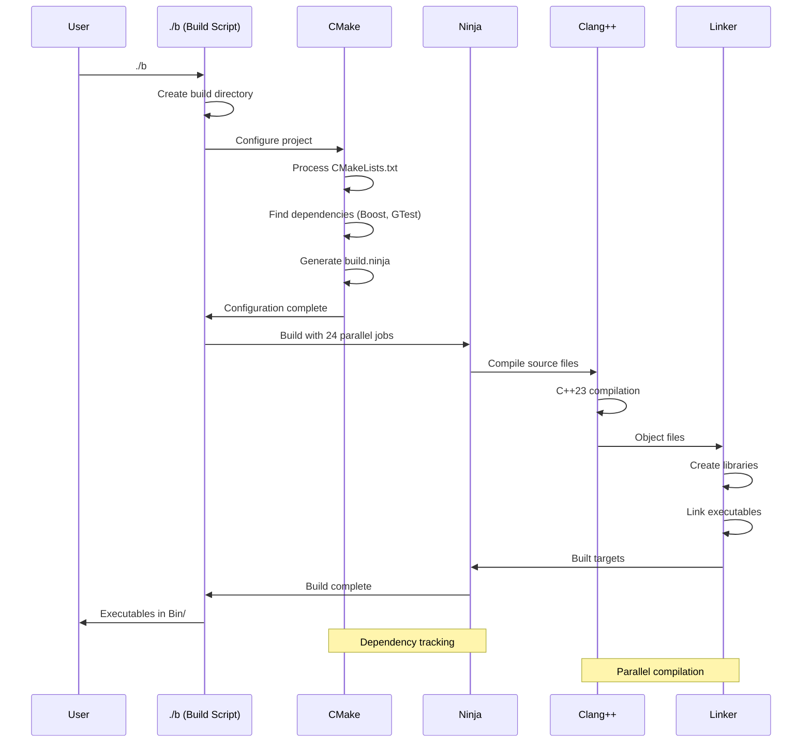
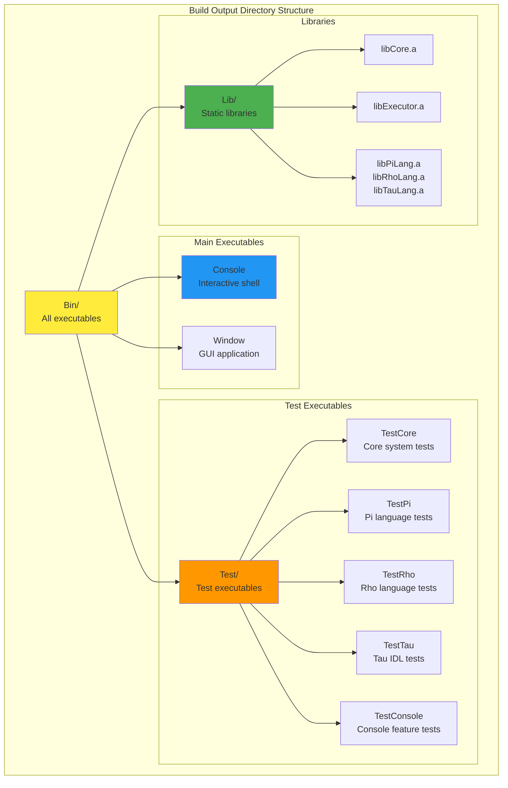
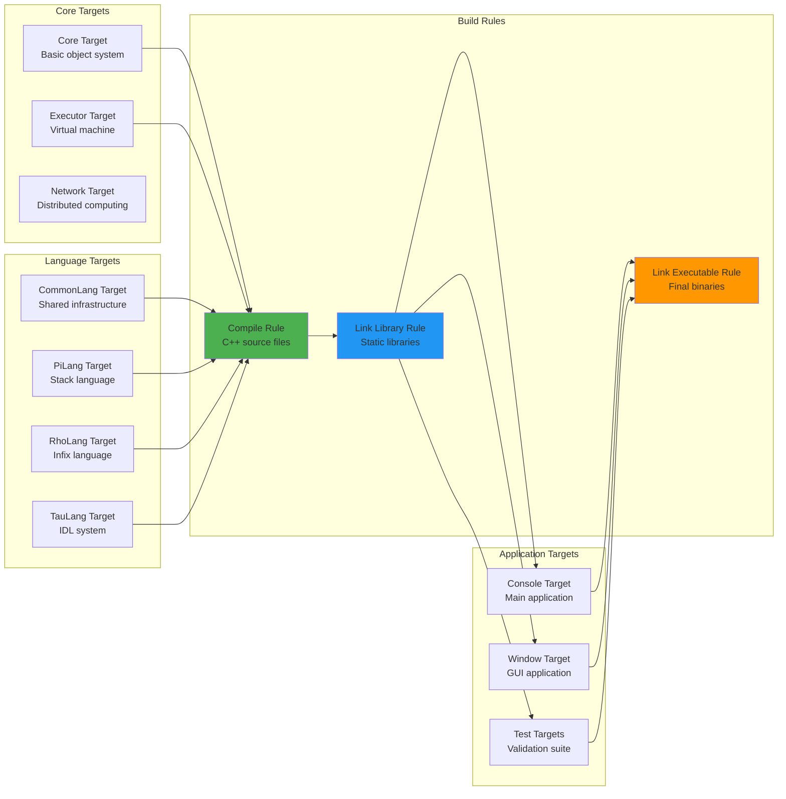

# KAI Build System Architecture

## CMake Project Structure

```mermaid
graph TB
    subgraph "Root Configuration"
        ROOT[CMakeLists.txt<br/>Project setup, compiler selection<br/>C++23 standard, dependencies]
    end
    
    subgraph "Library Layer"
        LIB_CMAKE[Source/Library/CMakeLists.txt<br/>Core libraries definition]
        
        subgraph "Core Libraries"
            CORE[Core Library<br/>Registry, Objects, Memory]
            EXECUTOR[Executor Library<br/>Virtual Machine, Stack]
            NETWORK[Network Library<br/>Distributed computing<br/>(conditional)]
        end
        
        subgraph "Language Libraries"
            COMMON_LANG[CommonLang<br/>Shared language infrastructure]
            PI_LANG[PiLang<br/>Stack-based language]
            RHO_LANG[RhoLang<br/>Infix language]
            TAU_LANG[TauLang<br/>IDL generator]
        end
    end
    
    subgraph "Application Layer"
        APP_CMAKE[Source/App/CMakeLists.txt<br/>Application definitions]
        
        subgraph "Applications"
            CONSOLE[Console<br/>Interactive shell]
            WINDOW[Window<br/>GUI application<br/>(optional)]
            NETTEST[NetworkTest<br/>Network validation]
            NETGEN[NetworkGenerate<br/>Code generation]
        end
    end
    
    subgraph "Test Layer"
        TEST_CMAKE[Test/CMakeLists.txt<br/>Test suite configuration]
        
        subgraph "Test Categories"
            CORE_TESTS[Core Tests<br/>Unit tests for core systems]
            LANG_TESTS[Language Tests<br/>Pi, Rho, Tau validation]
            NET_TESTS[Network Tests<br/>Distributed computing]
            CONSOLE_TESTS[Console Tests<br/>Interactive features]
        end
    end
    
    ROOT --> LIB_CMAKE
    ROOT --> APP_CMAKE
    ROOT --> TEST_CMAKE
    
    LIB_CMAKE --> CORE
    LIB_CMAKE --> EXECUTOR
    LIB_CMAKE --> NETWORK
    LIB_CMAKE --> COMMON_LANG
    LIB_CMAKE --> PI_LANG
    LIB_CMAKE --> RHO_LANG
    LIB_CMAKE --> TAU_LANG
    
    APP_CMAKE --> CONSOLE
    APP_CMAKE --> WINDOW
    APP_CMAKE --> NETTEST
    APP_CMAKE --> NETGEN
    
    TEST_CMAKE --> CORE_TESTS
    TEST_CMAKE --> LANG_TESTS
    TEST_CMAKE --> NET_TESTS
    TEST_CMAKE --> CONSOLE_TESTS
    
    style ROOT fill:#ffeb3b
    style CORE fill:#4caf50
    style CONSOLE fill:#2196f3
    style CORE_TESTS fill:#ff9800
```

## Dependency Graph

```mermaid
graph LR
    subgraph "External Dependencies"
        BOOST[Boost Libraries<br/>system, filesystem<br/>program_options, regex]
        GTEST[Google Test<br/>Unit testing framework]
        RAKNET[RakNet<br/>Network communication<br/>(stub implementation)]
    end
    
    subgraph "Core Layer"
        CORE[Core<br/>Registry, Objects<br/>Base functionality]
    end
    
    subgraph "Language Layer"
        COMMON[CommonLang<br/>Shared infrastructure]
        PI[PiLang<br/>Stack language]
        RHO[RhoLang<br/>Infix language] 
        TAU[TauLang<br/>IDL generator]
    end
    
    subgraph "Execution Layer"
        EXECUTOR[Executor<br/>Virtual machine]
        NETWORK[Network<br/>Distributed computing]
    end
    
    subgraph "Application Layer"
        CONSOLE[Console Application]
        WINDOW[Window Application]
        TESTS[Test Executables]
    end
    
    BOOST --> CORE
    GTEST --> TESTS
    RAKNET --> NETWORK
    
    CORE --> COMMON
    CORE --> EXECUTOR
    COMMON --> PI
    PI --> RHO
    COMMON --> TAU
    
    EXECUTOR --> CONSOLE
    EXECUTOR --> WINDOW
    NETWORK --> CONSOLE
    
    PI --> TESTS
    RHO --> TESTS
    TAU --> TESTS
    EXECUTOR --> TESTS
    
    style BOOST fill:#e1f5fe
    style CORE fill:#4caf50
    style CONSOLE fill:#2196f3
    style TESTS fill:#ff9800
```

## Build Configuration Options

```mermaid
graph TD
    subgraph "Compiler Selection"
        COMPILER{Compiler Choice}
        COMPILER --> CLANG[Clang++ (default)<br/>Modern C++ support<br/>Better diagnostics]
        COMPILER --> GCC[GCC<br/>Alternative option<br/>-DBUILD_GCC=ON]
    end
    
    subgraph "Build Features"
        FEATURES[Build Features]
        FEATURES --> CPP23[C++23 Standard<br/>Latest language features]
        FEATURES --> NINJA[Ninja Generator<br/>Fast parallel builds]
        FEATURES --> OUTDIR[Output Directory<br/>Bin/ for all executables]
    end
    
    subgraph "Optional Components"
        OPTIONS[Component Options]
        OPTIONS --> RAKNET_OPT[KAI_BUILD_RAKNET<br/>Enable real RakNet<br/>Default: OFF (stub)]
        OPTIONS --> NETWORK_OPT[KAI_BUILD_NETWORK_APPS<br/>Network applications<br/>Default: OFF]
        OPTIONS --> TESTS_OPT[KAI_BUILD_TEST_ALL<br/>Complete test suite<br/>Default: ON]
        OPTIONS --> SHELL_OPT[ENABLE_SHELL_SYNTAX<br/>Backtick operations<br/>Security setting]
    end
    
    subgraph "Platform Support"
        PLATFORMS[Platform Configuration]
        PLATFORMS --> LINUX[Linux<br/>Primary development]
        PLATFORMS --> WINDOWS[Windows<br/>Cross-platform support]
        PLATFORMS --> MACOS[macOS<br/>Unix compatibility]
    end
    
    style CLANG fill:#4caf50
    style CPP23 fill:#2196f3
    style RAKNET_OPT fill:#ff9800
    style LINUX fill:#9c27b0
```

## Build Process Flow



## Output Structure



## Build Targets and Rules

