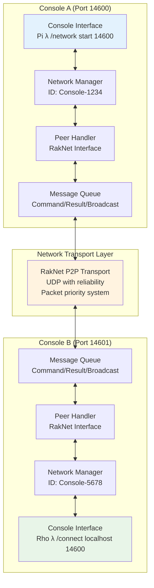
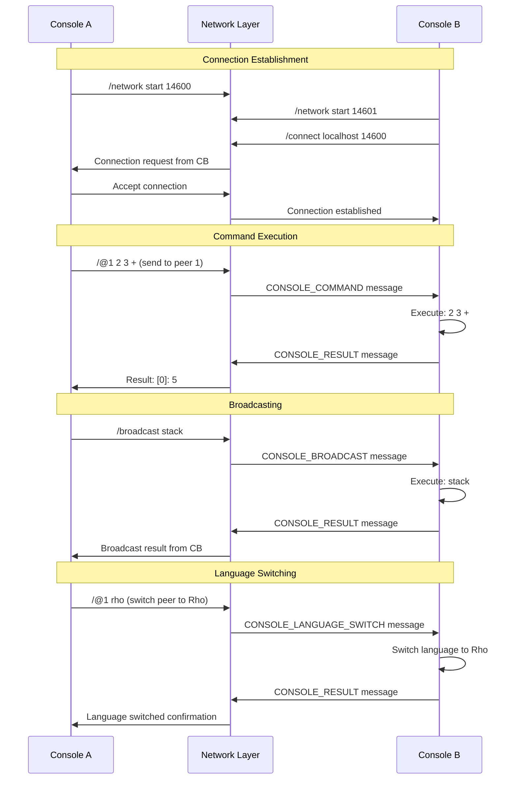
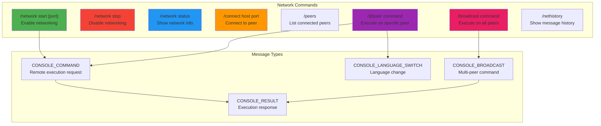
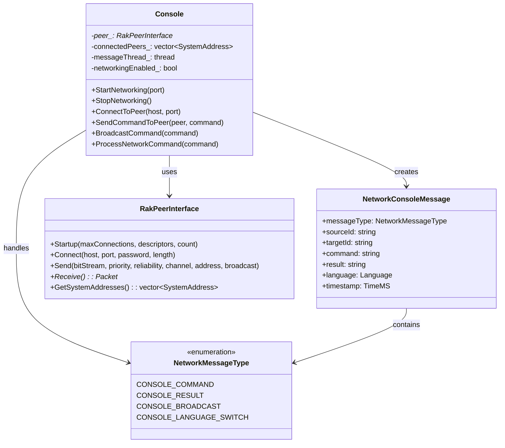
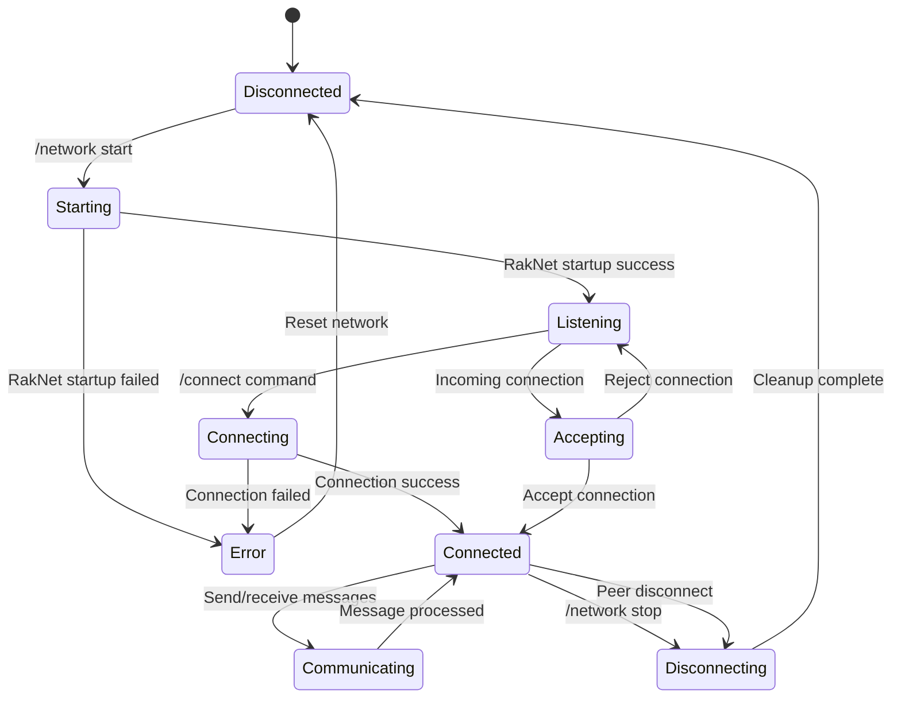
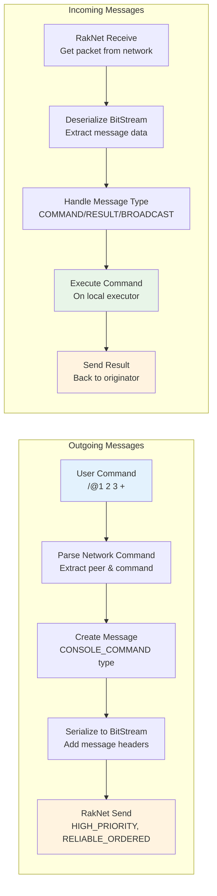
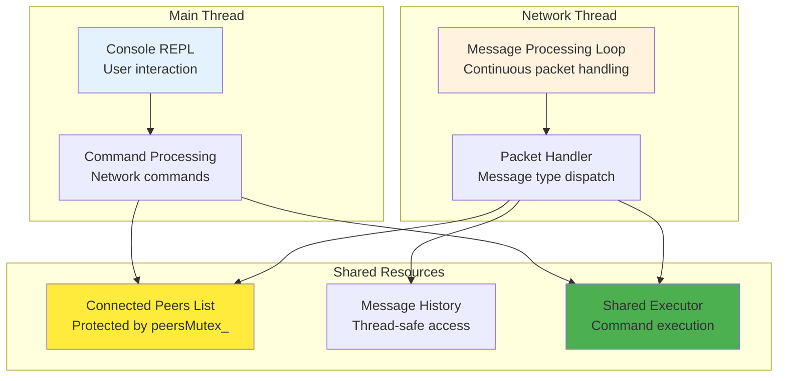

# KAI Console Networking Architecture

## Console-to-Console Communication Model

## Network Message Protocol

## Network Command Structure

## Network Architecture Components

## Peer Discovery and Connection Flow

## Message Processing Pipeline

## Thread Safety and Concurrency

