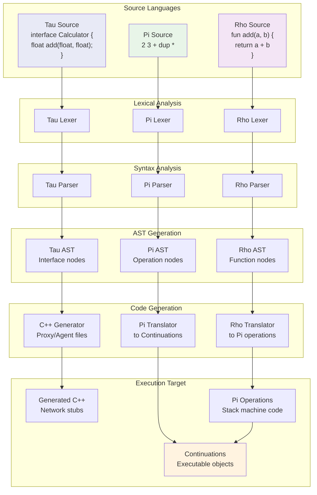
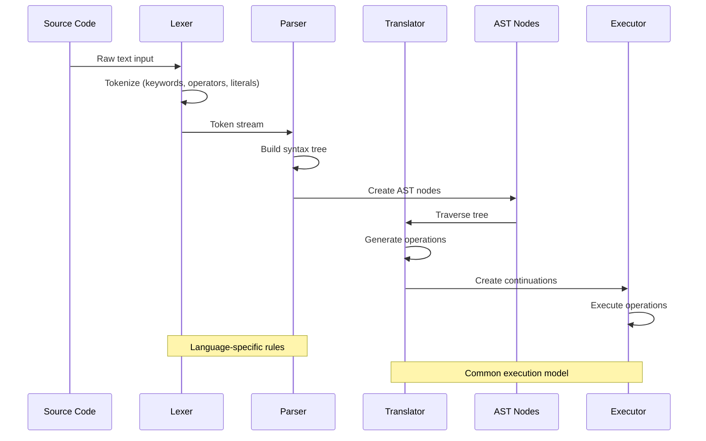
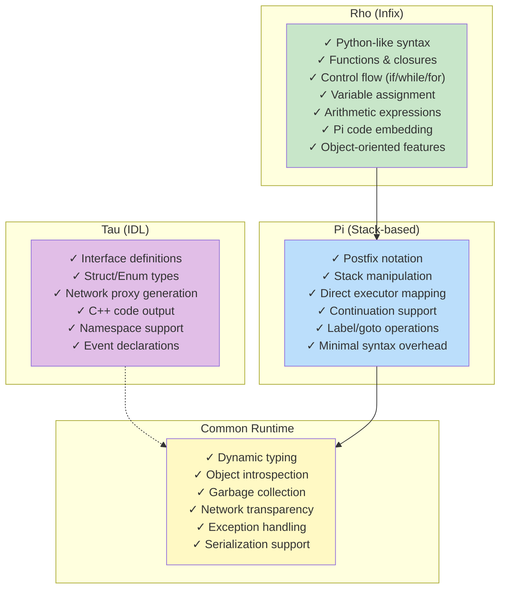
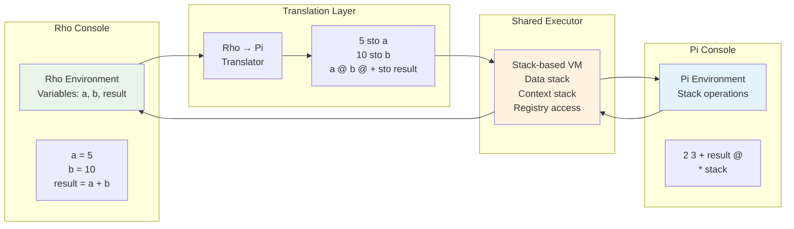
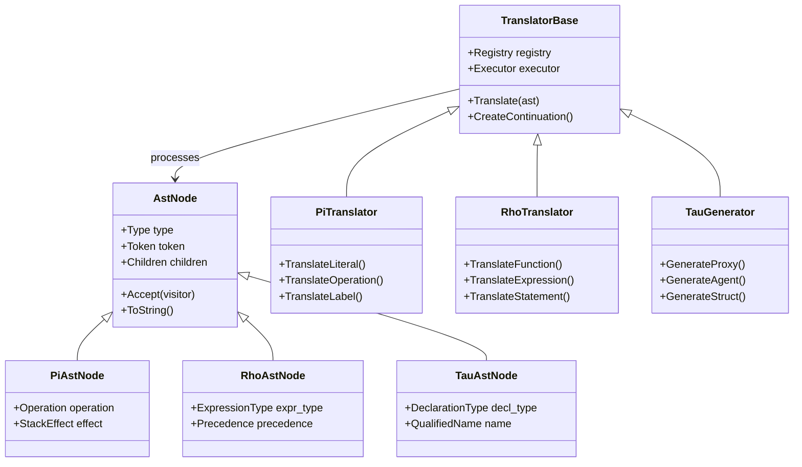

# KAI Language System Architecture

## Language Translation Pipeline

```mermaid
graph TD
    subgraph "Source Languages"
        TAU_SRC["Tau Source<br/>interface Calculator {<br/>  float add(float, float);<br/>}"]
        RHO_SRC["Rho Source<br/>fun add(a, b) {<br/>  return a + b<br/>}"]
        PI_SRC["Pi Source<br/>2 3 + dup *"]
    end
    
    subgraph "Lexical Analysis"
        TAU_LEX[Tau Lexer]
        RHO_LEX[Rho Lexer]  
        PI_LEX[Pi Lexer]
    end
    
    subgraph "Syntax Analysis"
        TAU_PAR[Tau Parser]
        RHO_PAR[Rho Parser]
        PI_PAR[Pi Parser]
    end
    
    subgraph "AST Generation"
        TAU_AST[Tau AST<br/>Interface nodes]
        RHO_AST[Rho AST<br/>Function nodes]
        PI_AST[Pi AST<br/>Operation nodes]
    end
    
    subgraph "Code Generation"
        TAU_GEN[C++ Generator<br/>Proxy/Agent files]
        RHO_TRANS[Rho Translator<br/>to Pi operations]
        PI_TRANS[Pi Translator<br/>to Continuations]
    end
    
    subgraph "Execution Target"
        CPP_CODE[Generated C++<br/>Network stubs]
        PI_OPS[Pi Operations<br/>Stack machine code]
        CONTINUATIONS[Continuations<br/>Executable objects]
    end
    
    TAU_SRC --> TAU_LEX --> TAU_PAR --> TAU_AST --> TAU_GEN --> CPP_CODE
    RHO_SRC --> RHO_LEX --> RHO_PAR --> RHO_AST --> RHO_TRANS --> PI_OPS
    PI_SRC --> PI_LEX --> PI_PAR --> PI_AST --> PI_TRANS --> CONTINUATIONS
    
    PI_OPS --> CONTINUATIONS
    
    style TAU_SRC fill:#e8eaf6
    style RHO_SRC fill:#f3e5f5
    style PI_SRC fill:#e8f5e8
    style CONTINUATIONS fill:#fff3e0
```

## Language Compilation Flow

```mermaid
sequenceDiagram
    participant Source as Source Code
    participant Lexer as Lexer
    participant Parser as Parser  
    participant Translator as Translator
    participant AST as AST Nodes
    participant Executor as Executor
    
    Source->>Lexer: Raw text input
    Lexer->>Lexer: Tokenize (keywords, operators, literals)
    Lexer->>Parser: Token stream
    Parser->>Parser: Build syntax tree
    Parser->>AST: Create AST nodes
    AST->>Translator: Traverse tree
    Translator->>Translator: Generate operations
    Translator->>Executor: Create continuations
    Executor->>Executor: Execute operations
    
    Note over Lexer,Parser: Language-specific rules
    Note over Translator,Executor: Common execution model
```

## Language Feature Matrix

```mermaid
graph TB
    subgraph "Tau (IDL)"
        TAU_FEATURES["✓ Interface definitions<br/>✓ Struct/Enum types<br/>✓ Network proxy generation<br/>✓ C++ code output<br/>✓ Namespace support<br/>✓ Event declarations"]
    end
    
    subgraph "Rho (Infix)"
        RHO_FEATURES["✓ Python-like syntax<br/>✓ Functions & closures<br/>✓ Control flow (if/while/for)<br/>✓ Variable assignment<br/>✓ Arithmetic expressions<br/>✓ Pi code embedding<br/>✓ Object-oriented features"]
    end
    
    subgraph "Pi (Stack-based)"
        PI_FEATURES["✓ Postfix notation<br/>✓ Stack manipulation<br/>✓ Direct executor mapping<br/>✓ Continuation support<br/>✓ Label/goto operations<br/>✓ Minimal syntax overhead"]
    end
    
    subgraph "Common Runtime"
        COMMON["✓ Dynamic typing<br/>✓ Object introspection<br/>✓ Garbage collection<br/>✓ Network transparency<br/>✓ Exception handling<br/>✓ Serialization support"]
    end
    
    TAU_FEATURES -.-> COMMON
    RHO_FEATURES --> PI_FEATURES
    PI_FEATURES --> COMMON
    
    style TAU_FEATURES fill:#e1bee7
    style RHO_FEATURES fill:#c8e6c9  
    style PI_FEATURES fill:#bbdefb
    style COMMON fill:#fff9c4
```

## Cross-Language Communication

```mermaid
graph LR
    subgraph "Rho Console"
        RHO_CONSOLE[Rho Environment<br/>Variables: a, b, result]
        RHO_CODE[a = 5<br/>b = 10<br/>result = a + b]
    end
    
    subgraph "Translation Layer"
        RHO_TRANS[Rho → Pi<br/>Translator]
        PI_OPS[5 sto a<br/>10 sto b<br/>a @ b @ + sto result]
    end
    
    subgraph "Pi Console" 
        PI_CONSOLE[Pi Environment<br/>Stack operations]
        PI_CODE[2 3 + result @<br/>* stack]
    end
    
    subgraph "Shared Executor"
        EXECUTOR[Stack-based VM<br/>Data stack<br/>Context stack<br/>Registry access]
    end
    
    RHO_CONSOLE --> RHO_TRANS
    RHO_TRANS --> PI_OPS
    PI_OPS --> EXECUTOR
    PI_CONSOLE --> EXECUTOR
    EXECUTOR --> RHO_CONSOLE
    EXECUTOR --> PI_CONSOLE
    
    style RHO_CONSOLE fill:#e8f5e8
    style PI_CONSOLE fill:#e3f2fd
    style EXECUTOR fill:#fff3e0
```

## AST Node Hierarchy

```mermaid
classDiagram
    class AstNode {
        +Type type
        +Token token
        +Children children
        +Accept(visitor)
        +ToString()
    }
    
    class PiAstNode {
        +Operation operation
        +StackEffect effect
    }
    
    class RhoAstNode {
        +ExpressionType expr_type
        +Precedence precedence
    }
    
    class TauAstNode {
        +DeclarationType decl_type
        +QualifiedName name
    }
    
    class TranslatorBase {
        +Registry registry
        +Executor executor
        +Translate(ast)
        +CreateContinuation()
    }
    
    AstNode <|-- PiAstNode
    AstNode <|-- RhoAstNode  
    AstNode <|-- TauAstNode
    
    TranslatorBase --> AstNode : processes
    
    class PiTranslator {
        +TranslateLiteral()
        +TranslateOperation()
        +TranslateLabel()
    }
    
    class RhoTranslator {
        +TranslateFunction()
        +TranslateExpression()
        +TranslateStatement()
    }
    
    class TauGenerator {
        +GenerateProxy()
        +GenerateAgent()
        +GenerateStruct()
    }
    
    TranslatorBase <|-- PiTranslator
    TranslatorBase <|-- RhoTranslator
    TranslatorBase <|-- TauGenerator
```