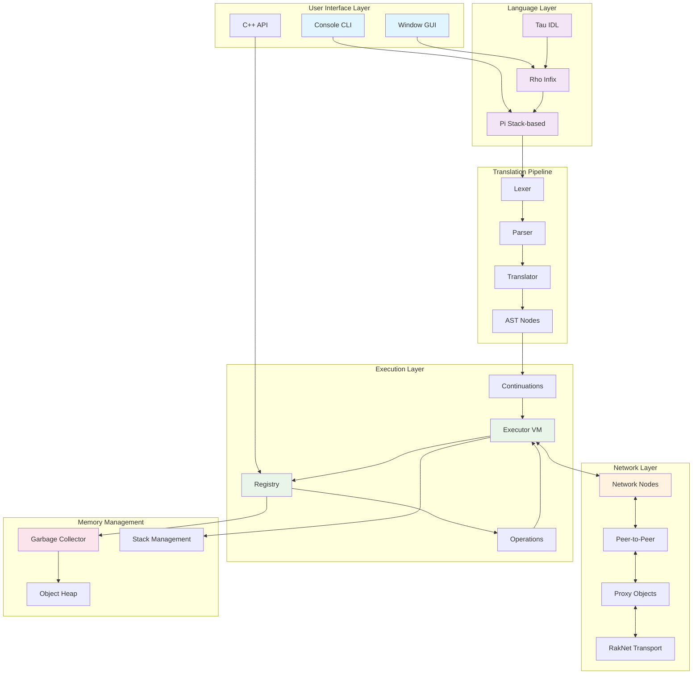
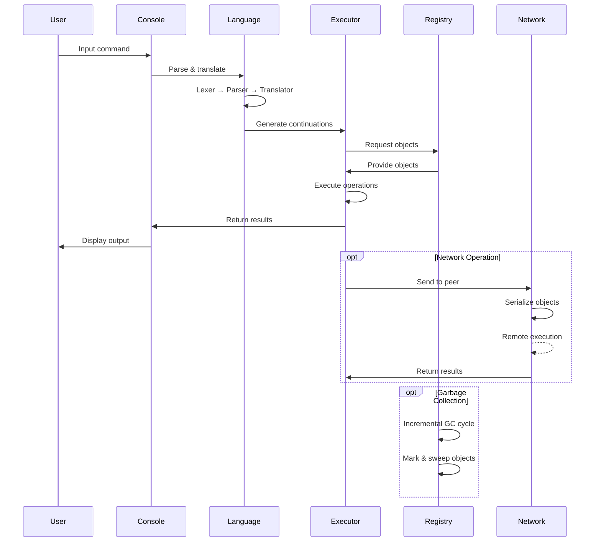
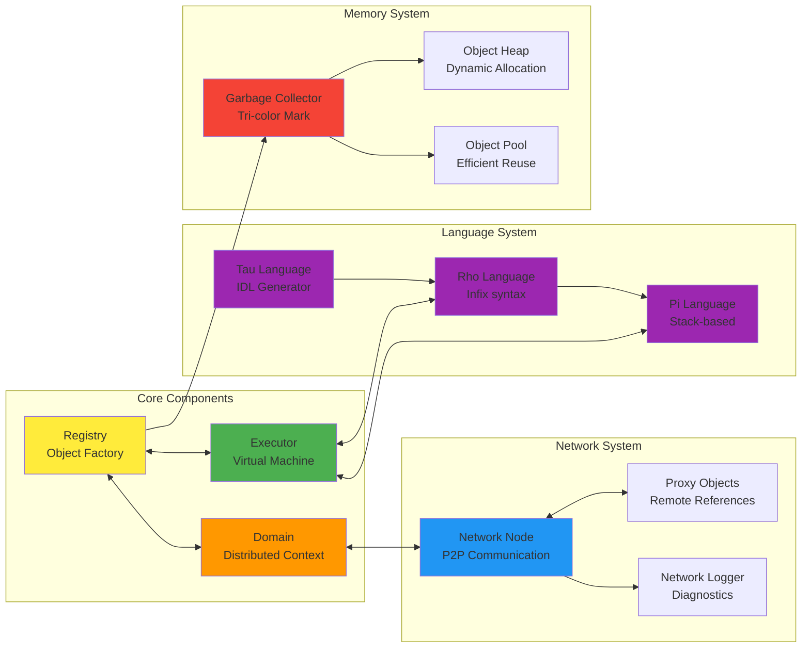

# KAI Overall System Architecture

## High-Level Component Overview

```mermaid
graph TB
    subgraph "User Interface Layer"
        CLI[Console CLI]
        WIN[Window GUI]
        API[C++ API]
    end
    
    subgraph "Language Layer"
        TAU["Tau IDL"]
        RHO["Rho Infix"]
        PI["Pi Stack-based"]
    end
    
    subgraph "Translation Pipeline"
        LEX[Lexer]
        PAR[Parser] 
        TRA[Translator]
        AST[AST Nodes]
    end
    
    subgraph "Execution Layer"
        EXE[Executor VM]
        REG[Registry]
        CON[Continuations]
        OPS[Operations]
    end
    
    subgraph "Network Layer"
        NODE[Network Nodes]
        PEER[Peer-to-Peer]
        PROXY[Proxy Objects]
        RAKNET[RakNet Transport]
    end
    
    subgraph "Memory Management"
        GC[Garbage Collector]
        HEAP[Object Heap]
        STACK[Stack Management]
    end
    
    CLI --> PI
    WIN --> RHO
    API --> REG
    
    TAU --> RHO
    RHO --> PI
    PI --> LEX
    
    LEX --> PAR
    PAR --> TRA
    TRA --> AST
    AST --> CON
    
    CON --> EXE
    EXE --> REG
    REG --> OPS
    OPS --> EXE
    
    EXE <--> NODE
    NODE <--> PEER
    PEER <--> PROXY
    PROXY <--> RAKNET
    
    REG --> GC
    GC --> HEAP
    EXE --> STACK
    
    style CLI fill:#e1f5fe
    style WIN fill:#e1f5fe
    style TAU fill:#f3e5f5  
    style RHO fill:#f3e5f5
    style PI fill:#f3e5f5
    style EXE fill:#e8f5e8
    style REG fill:#e8f5e8
    style NODE fill:#fff3e0
    style GC fill:#fce4ec
```

## Core Data Flow

```mermaid
sequenceDiagram
    participant User
    participant Console
    participant Language
    participant Executor
    participant Registry
    participant Network
    
    User->>Console: Input command
    Console->>Language: Parse & translate
    Language->>Language: Lexer → Parser → Translator
    Language->>Executor: Generate continuations
    Executor->>Registry: Request objects
    Registry->>Executor: Provide objects
    Executor->>Executor: Execute operations
    Executor->>Console: Return results
    Console->>User: Display output
    
    opt Network Operation
        Executor->>Network: Send to peer
        Network->>Network: Serialize objects
        Network-->>Network: Remote execution
        Network->>Executor: Return results
    end
    
    opt Garbage Collection
        Registry->>Registry: Incremental GC cycle
        Registry->>Registry: Mark & sweep objects
    end
```

## Component Relationships

```mermaid
graph LR
    subgraph "Core Components"
        REG["Registry<br/>Object Factory"]
        EXE["Executor<br/>Virtual Machine"]
        DOM["Domain<br/>Distributed Context"]
    end
    
    subgraph "Language System"
        PI["Pi Language<br/>Stack-based"]
        RHO["Rho Language<br/>Infix syntax"]
        TAU["Tau Language<br/>IDL Generator"]
    end
    
    subgraph "Network System"
        NODE[Network Node<br/>P2P Communication]
        PROXY[Proxy Objects<br/>Remote References]
        LOGGER[Network Logger<br/>Diagnostics]
    end
    
    subgraph "Memory System"
        GC[Garbage Collector<br/>Tri-color Mark]
        HEAP[Object Heap<br/>Dynamic Allocation]
        POOL[Object Pool<br/>Efficient Reuse]
    end
    
    REG <--> EXE
    REG <--> DOM
    EXE <--> PI
    EXE <--> RHO
    TAU --> RHO
    RHO --> PI
    
    DOM <--> NODE
    NODE <--> PROXY
    NODE --> LOGGER
    
    REG --> GC
    GC --> HEAP
    GC --> POOL
    
    style REG fill:#ffeb3b
    style EXE fill:#4caf50
    style DOM fill:#ff9800
    style PI fill:#9c27b0
    style RHO fill:#9c27b0
    style TAU fill:#9c27b0
    style NODE fill:#2196f3
    style GC fill:#f44336
```