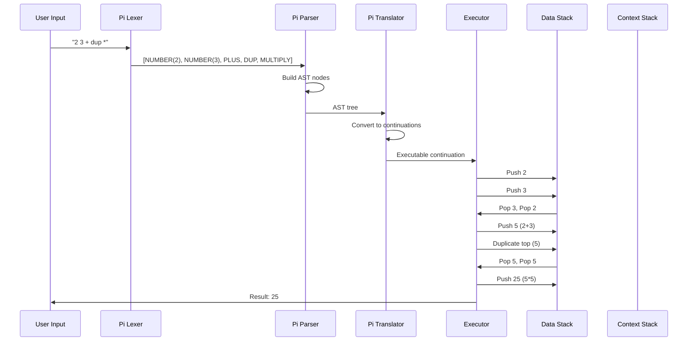
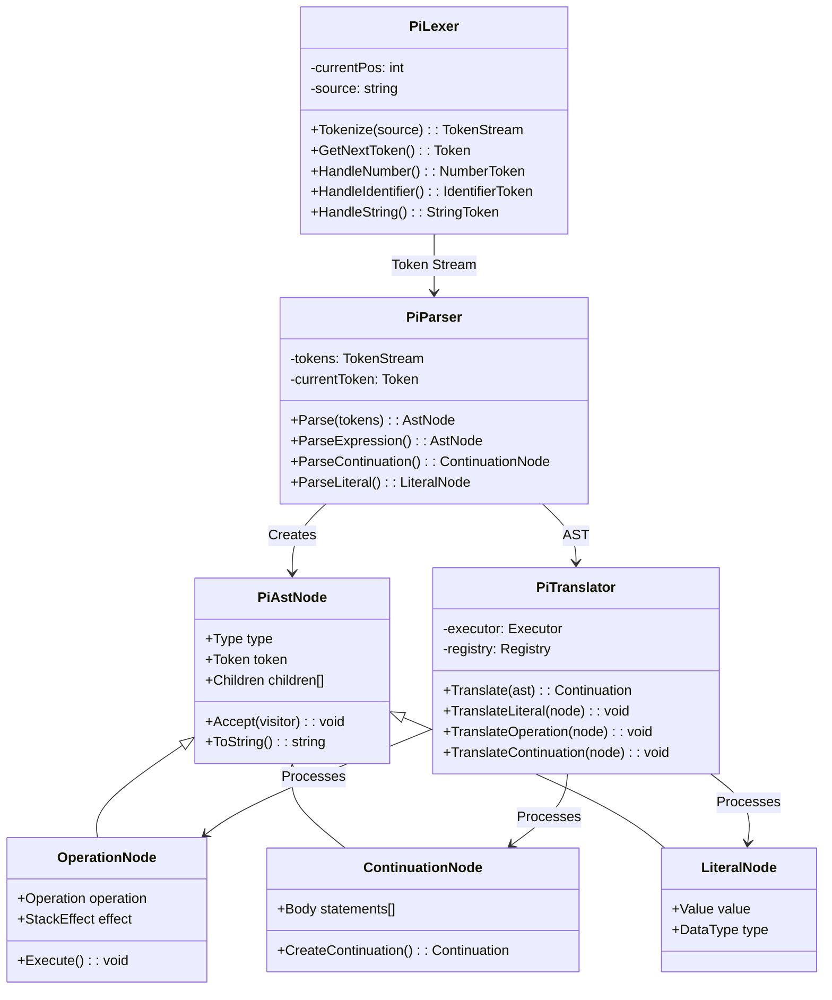
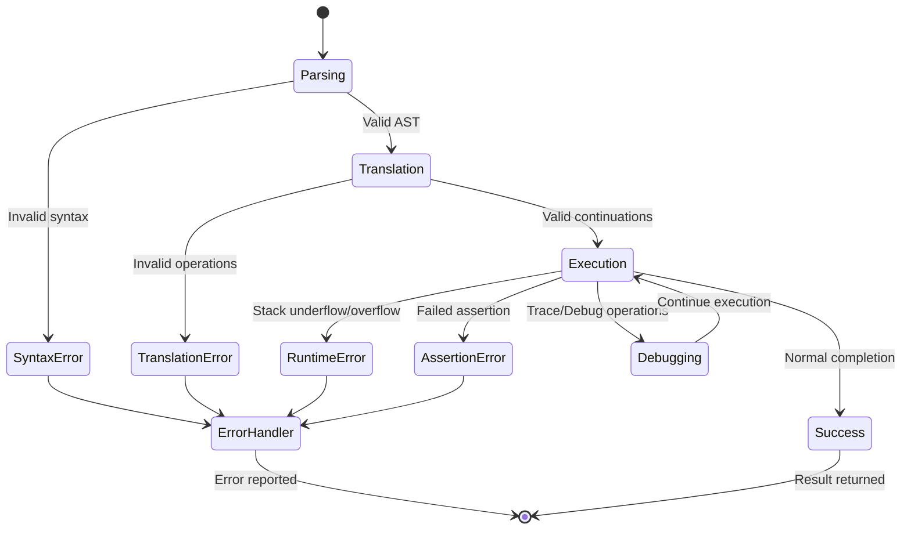
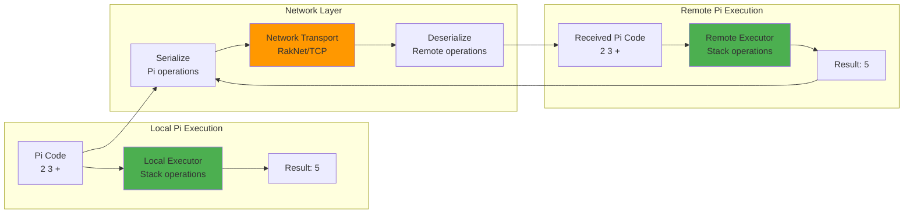
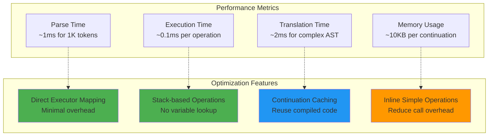

# Pi Language Architecture

## Pi Stack-Based Execution Model

```mermaid
graph TB
    subgraph "Pi Source Code"
        SRC[Pi Source<br/>2 3 + dup *<br/>{ 'square # } &]
    end
    
    subgraph "Lexical Analysis"
        LEX[Pi Lexer<br/>Tokenization]
        TOKENS[Token Stream<br/>NUMBER, NUMBER, PLUS<br/>DUP, MULTIPLY, etc.]
    end
    
    subgraph "Syntax Analysis"
        PAR[Pi Parser<br/>AST Construction]
        AST[Pi AST Nodes<br/>Operation nodes<br/>Literal nodes<br/>Continuation nodes]
    end
    
    subgraph "Translation"
        TRANS[Pi Translator<br/>AST → Continuations]
        CONT[Continuation Objects<br/>Executable code blocks]
    end
    
    subgraph "Execution Environment"
        EXE[Executor<br/>Stack-based VM]
        DS[Data Stack<br/>Values & Objects]
        CS[Context Stack<br/>Continuations & Control]
        REG[Registry<br/>Object Factory<br/>Type System]
    end
    
    SRC --> LEX
    LEX --> TOKENS
    TOKENS --> PAR
    PAR --> AST
    AST --> TRANS
    TRANS --> CONT
    CONT --> EXE
    EXE <--> DS
    EXE <--> CS
    EXE <--> REG
    
    style SRC fill:#e3f2fd
    style EXE fill:#4caf50
    style DS fill:#ff9800
    style CS fill:#9c27b0
    style REG fill:#2196f3
```

## Pi Stack Operations and Data Flow



## Pi Component Architecture



## Pi Stack Machine Operations

```mermaid
graph LR
    subgraph "Stack Operations"
        PUSH[PUSH<br/>Add to top]
        POP[POP<br/>Remove from top]
        DUP[DUP<br/>Duplicate top]
        SWAP[SWAP<br/>Exchange top two]
        DROP[DROP<br/>Remove top]
        OVER[OVER<br/>Copy second to top]
    end
    
    subgraph "Arithmetic Operations"
        ADD[ADD<br/>Pop a,b Push a+b]
        SUB[SUB<br/>Pop a,b Push b-a]
        MUL[MUL<br/>Pop a,b Push a*b]
        DIV[DIV<br/>Pop a,b Push b/a]
        MOD[MOD<br/>Pop a,b Push b%a]
    end
    
    subgraph "Control Operations"
        IFE[IFE<br/>Conditional execution]
        CONT[CONTINUATION<br/>Code block creation]
        EXEC[EXEC (&)<br/>Execute continuation]
        SUSPEND[SUSPEND<br/>Pause execution]
        RESUME[RESUME<br/>Return to context]
    end
    
    subgraph "Variable Operations"
        STORE[STORE (#)<br/>Save to registry]
        FETCH[FETCH (@)<br/>Load from registry]
        ASSERT[ASSERT<br/>Validate condition]
        TRACE[TRACE<br/>Debug output]
    end
    
    style PUSH fill:#4caf50
    style ADD fill:#ff9800
    style IFE fill:#9c27b0
    style STORE fill:#2196f3
```

## Pi Continuation Model

```mermaid
graph TB
    subgraph "Continuation Creation"
        SRC_CONT[Source: { 2 3 + }]
        LEX_CONT[Lexer: Parse continuation body]
        AST_CONT[AST: Continuation node with body]
        TRANS_CONT[Translator: Create continuation object]
        CONT_OBJ[Continuation Object<br/>Executable code block]
    end
    
    subgraph "Continuation Execution"
        EXEC_CONT[& operator: Execute continuation]
        PUSH_CONTEXT[Push current context to context stack]
        EXEC_BODY[Execute continuation body operations]
        POP_CONTEXT[Pop context from context stack]
        RETURN[Return to caller]
    end
    
    subgraph "Continuation Control"
        SUSPEND_OP[SUSPEND: Pause and switch context]
        RESUME_OP[RESUME: Return to suspended context]
        REPLACE_OP[REPLACE: Substitute continuation]
    end
    
    SRC_CONT --> LEX_CONT --> AST_CONT --> TRANS_CONT --> CONT_OBJ
    CONT_OBJ --> EXEC_CONT
    EXEC_CONT --> PUSH_CONTEXT --> EXEC_BODY --> POP_CONTEXT --> RETURN
    
    EXEC_BODY -.-> SUSPEND_OP
    SUSPEND_OP -.-> RESUME_OP
    RESUME_OP -.-> REPLACE_OP
    
    style CONT_OBJ fill:#4caf50
    style EXEC_BODY fill:#ff9800
    style SUSPEND_OP fill:#9c27b0
```

## Pi Error Handling and Debugging



## Pi Network Integration



## Pi Performance Characteristics

