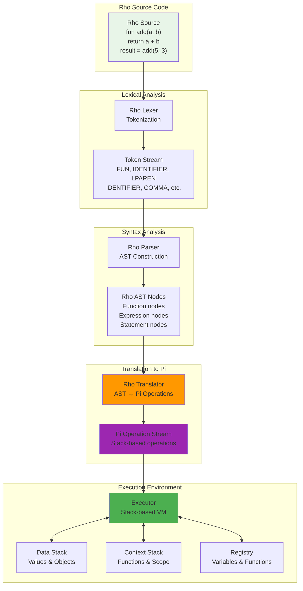
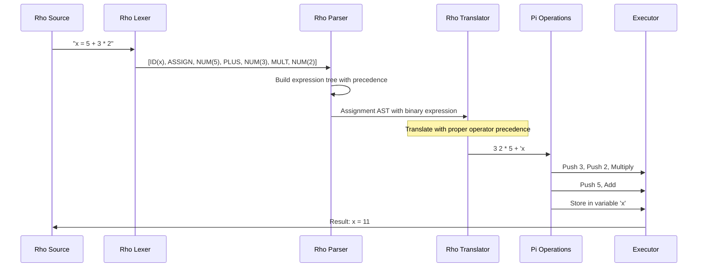
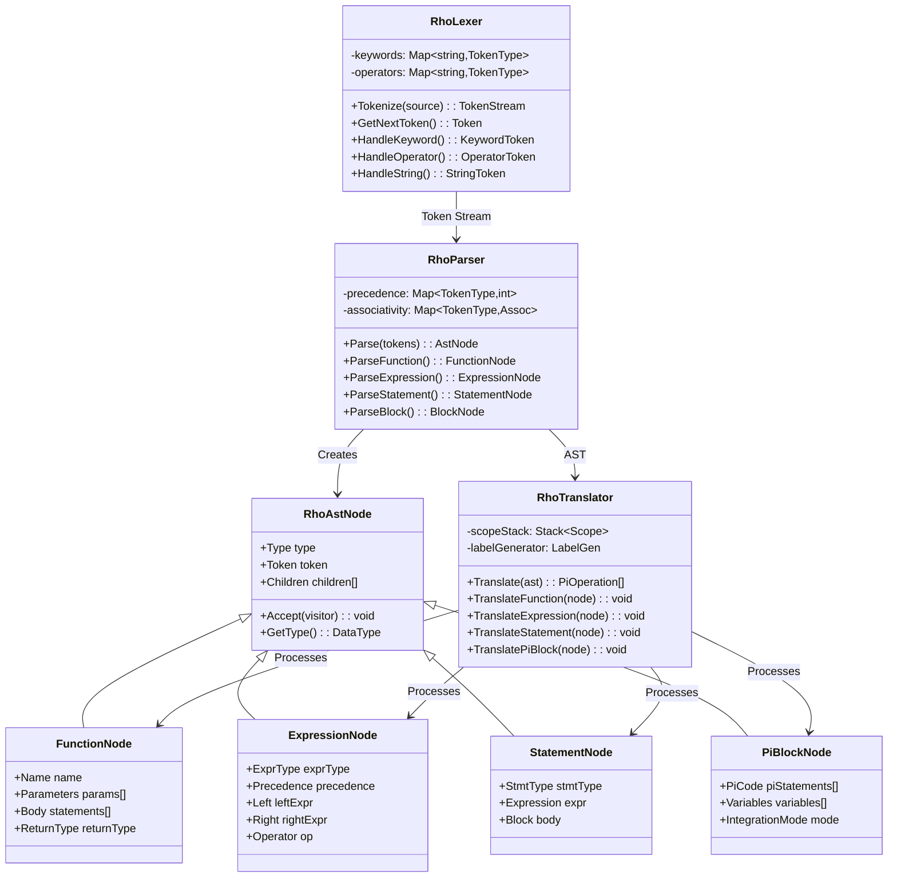
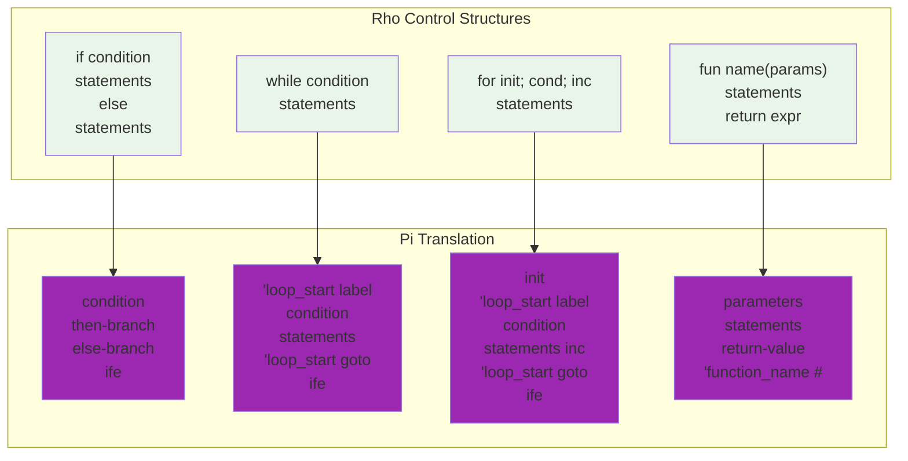
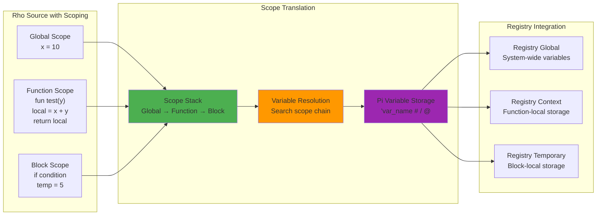
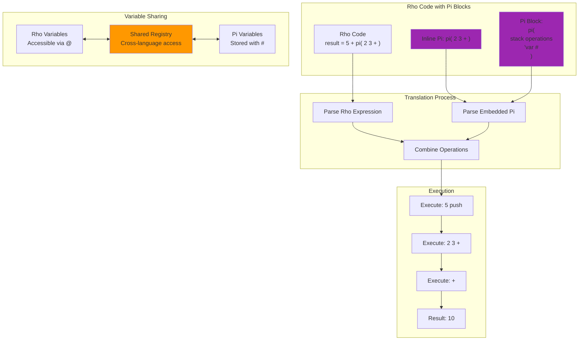
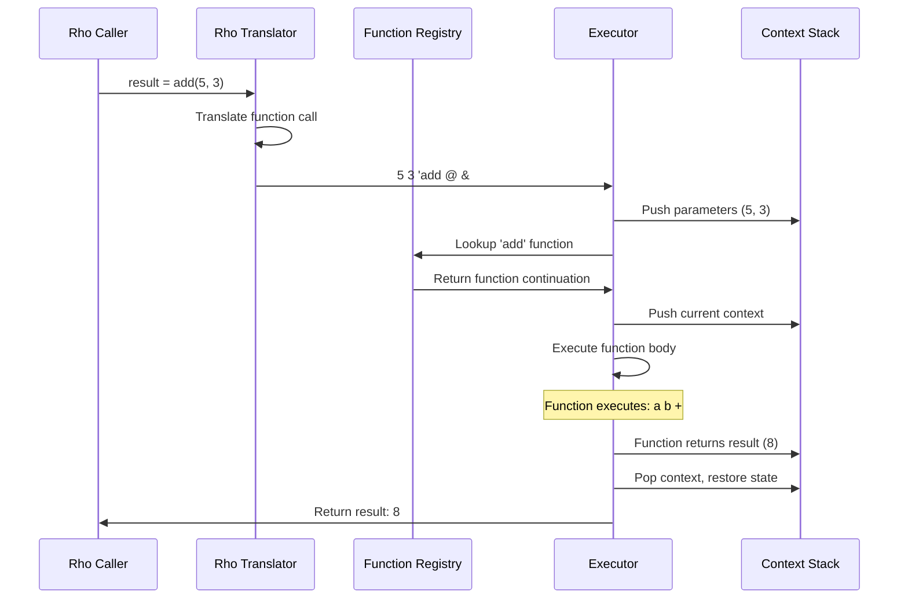
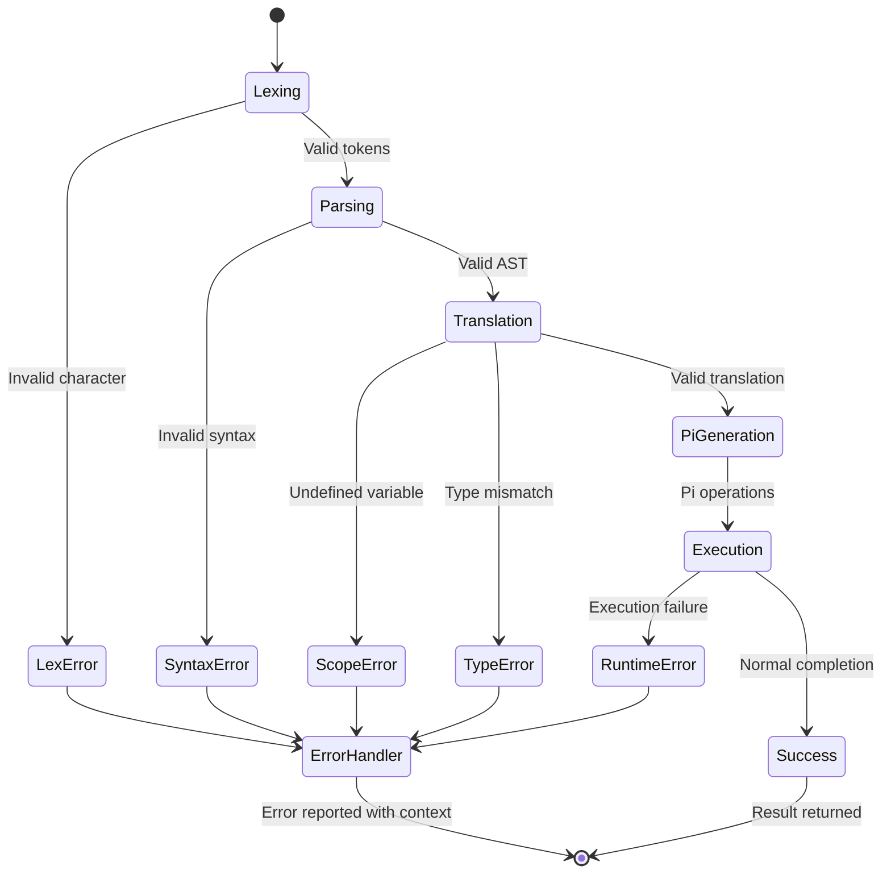
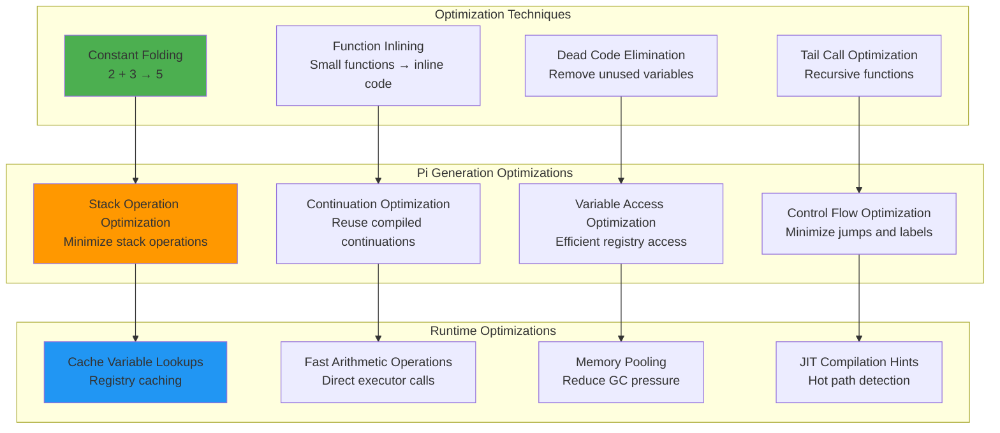
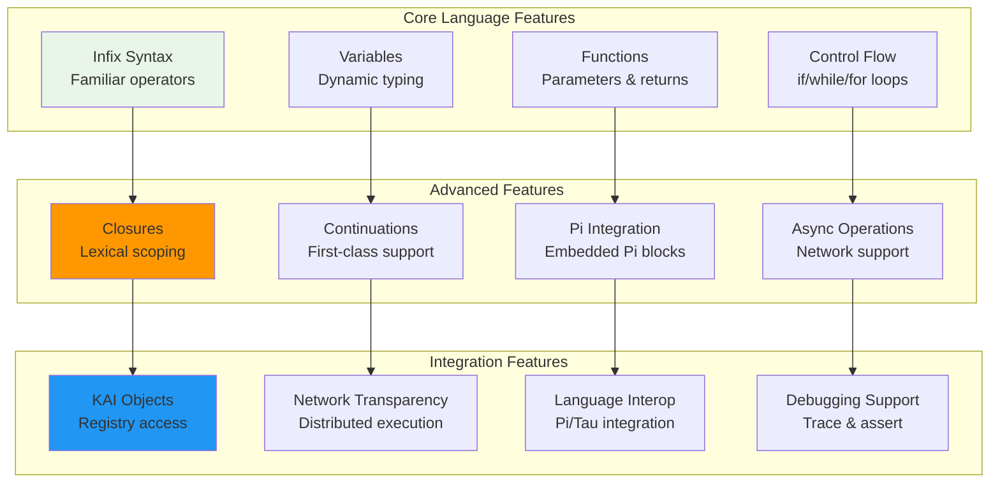

# Rho Language Architecture

This document provides comprehensive visual documentation of Rho's architecture, translation pipeline, and integration mechanisms. Rho is KAI's high-level infix language that compiles down to Pi operations for execution.

## Overview

Rho serves as the primary application programming language in the KAI ecosystem. It provides familiar infix syntax while maintaining full access to Pi's stack-based capabilities and KAI's distributed object model. The architecture is designed around a multi-stage translation pipeline that converts high-level Rho code into efficient Pi operations.

## Rho Infix Language Translation Pipeline

The core translation pipeline transforms Rho source code through several well-defined stages, each with specific responsibilities:

### Pipeline Stages Explained

1. **Lexical Analysis**: The Rho lexer tokenizes source code, identifying keywords, operators, identifiers, and literals. It handles Rho's infix syntax and prepares tokens for parsing.

2. **Syntax Analysis**: The parser constructs an Abstract Syntax Tree (AST) from the token stream, handling operator precedence, function definitions, control structures, and Pi block integration.

3. **Translation to Pi**: The translator converts the AST into Pi operations, managing scope, variable access, and control flow transformation. This stage bridges high-level Rho constructs with low-level Pi operations.

4. **Execution Environment**: The Pi operations execute on KAI's stack-based virtual machine, utilizing the data stack for values, context stack for control flow, and registry for variable storage.

## Rho Expression Translation Model

This sequence diagram illustrates how a typical Rho expression is processed through the translation pipeline, showing the transformation from infix notation to stack-based Pi operations:

### Expression Translation Details

The example shows how `x = 5 + 3 * 2` is processed:

1. **Lexical Analysis**: Source code is tokenized into discrete elements
2. **Syntax Analysis**: Parser builds an expression tree respecting operator precedence (multiplication before addition)  
3. **Translation**: AST is converted to postfix Pi operations: `3 2 * 5 + 'x #`
4. **Execution**: Pi operations execute left-to-right on the stack, producing the correct result (11)

This demonstrates how Rho's familiar infix syntax is efficiently translated to Pi's postfix notation while preserving mathematical correctness.

## Rho Component Architecture

The class diagram below shows the key components of Rho's implementation and their relationships. Each component has specific responsibilities in the translation pipeline:

### Component Responsibilities

- **RhoLexer**: Handles tokenization of Rho source code, managing keywords, operators, strings, and Pi block boundaries
- **RhoParser**: Constructs AST from tokens, handling precedence, associativity, and complex language constructs  
- **RhoTranslator**: Converts AST to Pi operations, managing scope resolution, control flow translation, and Pi integration
- **AST Nodes**: Represent different language constructs (functions, expressions, statements, Pi blocks) with type information and behavior

The inheritance hierarchy shows how different AST node types specialize the base RhoAstNode interface, enabling polymorphic processing during translation.

## Rho Control Flow Translation

Rho's control structures are translated into equivalent Pi operations. This diagram shows how high-level control flow constructs map to stack-based Pi implementations:

### Control Flow Translation Details

Each Rho control structure has a specific Pi translation pattern:

- **Conditionals**: `if condition` becomes Pi's postfix conditional `condition then-branch else-branch ife`
- **Loops**: `while condition` uses labels and conditional jumps in Pi for efficient iteration
- **For Loops**: Complex initialization, condition checking, and increment logic translated to Pi operations
- **Functions**: Function definitions become Pi continuations stored in the registry with parameter handling

The translation maintains the semantic meaning while leveraging Pi's continuation-based control flow model.

## Rho Scoping and Variable Management

Rho implements lexical scoping that integrates seamlessly with Pi's variable storage system. This diagram shows how variables are resolved across different scopes:

### Scoping Implementation

Rho's scoping system works through several key mechanisms:

1. **Scope Stack**: Maintains a hierarchy of scopes (Global → Function → Block) for proper variable resolution
2. **Variable Resolution**: Searches the scope chain from innermost to outermost scope for variable lookups
3. **Pi Variable Storage**: Maps to Pi's registry system using `#` for storage and `@` for retrieval
4. **Registry Integration**: Different registry contexts handle global, function-local, and temporary variables

This design ensures that Rho's lexical scoping rules are preserved while utilizing Pi's efficient variable storage mechanisms.

## Rho-Pi Integration Model

One of Rho's most powerful features is seamless integration with Pi code. This diagram illustrates how Pi blocks are embedded within Rho expressions and how the two languages share variables:

### Pi Integration Benefits

- **Shared Variable Space**: Both languages access the same registry, enabling seamless data sharing
- **Performance Optimization**: Critical code sections can use Pi for stack-based efficiency  
- **Gradual Migration**: Rho code can incrementally adopt Pi patterns where beneficial
- **Unified Execution**: Both language styles execute on the same Pi virtual machine

## Rho Function Call Mechanism

Function calls in Rho follow a specific protocol that integrates with Pi's continuation system:

### Function Call Protocol

Function calls demonstrate the integration between Rho's high-level syntax and Pi's execution model, showing parameter passing, context management, and result handling.

## Rho Error Handling and Debugging

Rho's error handling system provides comprehensive error detection and reporting across all translation phases:

### Error Handling Strategy

The state diagram shows how errors are detected at each phase and routed to appropriate handlers with contextual information for debugging.

## Rho Performance Optimization  

Rho employs multiple optimization strategies across compilation and runtime phases:

### Optimization Layers

The optimization pipeline works at three levels:
1. **Compile-time**: Constant folding, dead code elimination, function inlining
2. **Translation**: Pi generation optimizations for efficient stack operations  
3. **Runtime**: Caching, fast operations, memory management, and JIT preparation

## Rho Language Feature Matrix

This final diagram summarizes Rho's complete feature set and how capabilities build upon each other:

### Feature Progression

Rho's architecture supports a natural progression from basic syntax to advanced distributed computing:

- **Core Features**: Provide familiar programming constructs (variables, functions, control flow)
- **Advanced Features**: Add sophisticated capabilities (closures, continuations, Pi integration)  
- **Integration Features**: Enable distributed computing and system integration

This layered approach allows developers to adopt Rho incrementally, starting with familiar patterns and gradually leveraging more advanced capabilities as needed.

## Conclusion

Rho's architecture demonstrates how high-level language features can be efficiently implemented on top of a stack-based virtual machine. The multi-stage translation pipeline, comprehensive error handling, and seamless Pi integration make Rho both powerful and approachable for KAI application development.

The visual diagrams in this document illustrate the sophisticated engineering that enables Rho to provide familiar syntax while maintaining full access to KAI's distributed object model and Pi's performance characteristics.