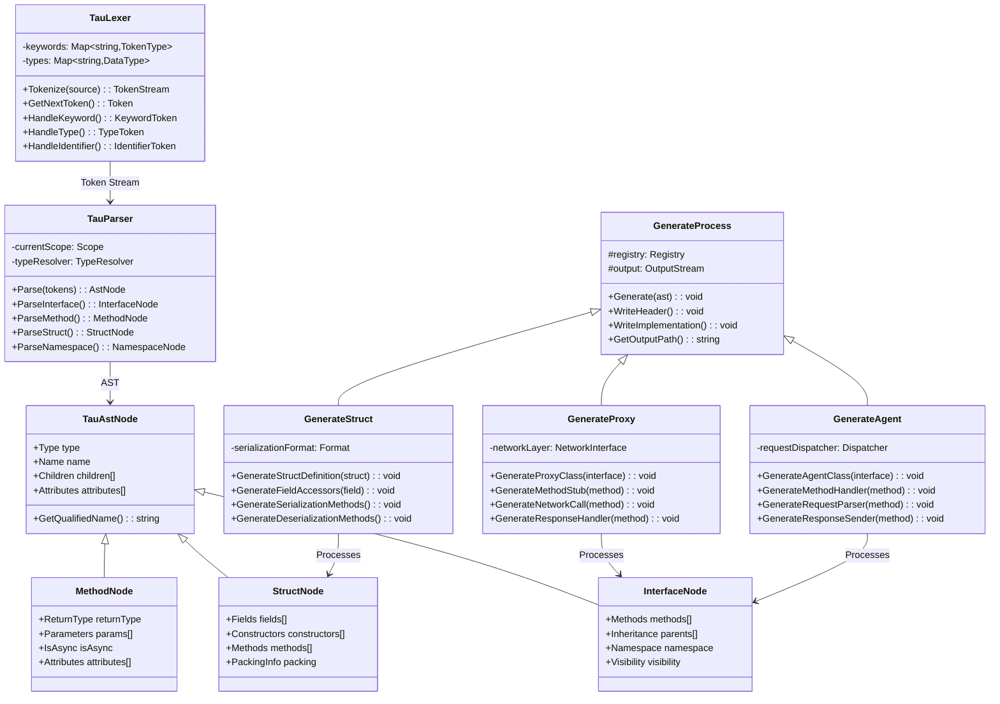
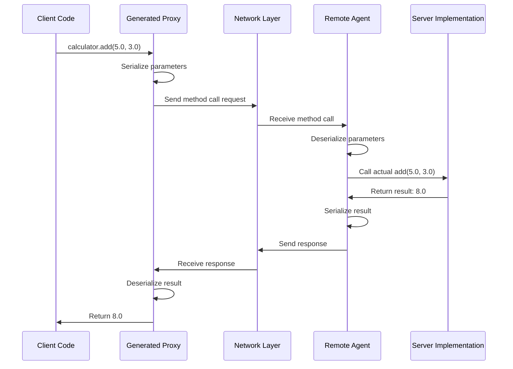
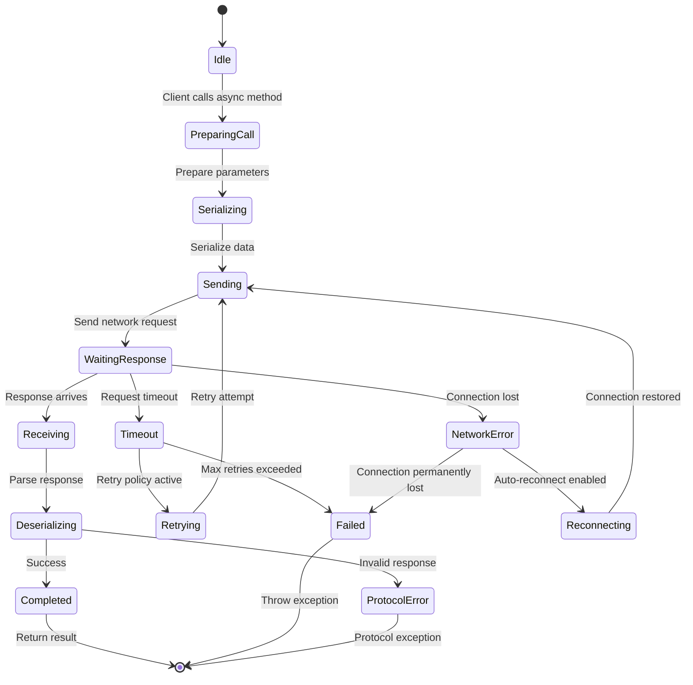
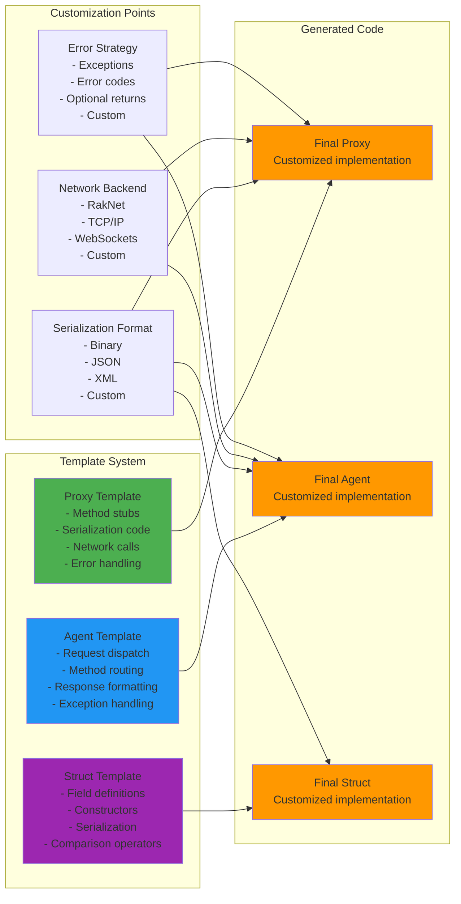

# Tau Language Architecture

## Tau Interface Definition Language Pipeline

```mermaid
graph TB
    subgraph "Tau Source Code"
        SRC[Tau IDL<br/>interface Calculator {<br/>  float add(float a, float b);<br/>  float multiply(float a, float b);<br/>}]
    end
    
    subgraph "Lexical Analysis"
        LEX[Tau Lexer<br/>Tokenization]
        TOKENS[Token Stream<br/>INTERFACE, IDENTIFIER<br/>FLOAT, IDENTIFIER, etc.]
    end
    
    subgraph "Syntax Analysis"
        PAR[Tau Parser<br/>AST Construction]
        AST[Tau AST Nodes<br/>Interface nodes<br/>Method nodes<br/>Type nodes]
    end
    
    subgraph "Code Generation"
        GEN[Tau Generator<br/>Multi-target generation]
        PROXY[Proxy Generation<br/>Client-side stubs]
        AGENT[Agent Generation<br/>Server-side handlers]
        STRUCT[Struct Generation<br/>Data structures]
    end
    
    subgraph "Generated Output"
        CPP_PROXY[C++ Proxy Classes<br/>Network client code]
        CPP_AGENT[C++ Agent Classes<br/>Network server code]  
        CPP_STRUCT[C++ Struct Definitions<br/>Data transfer objects]
    end
    
    SRC --> LEX
    LEX --> TOKENS
    TOKENS --> PAR
    PAR --> AST
    AST --> GEN
    GEN --> PROXY
    GEN --> AGENT
    GEN --> STRUCT
    PROXY --> CPP_PROXY
    AGENT --> CPP_AGENT
    STRUCT --> CPP_STRUCT
    
    style SRC fill:#e1bee7
    style GEN fill:#ff9800
    style CPP_PROXY fill:#4caf50
    style CPP_AGENT fill:#2196f3
    style CPP_STRUCT fill:#9c27b0
```

## Tau Code Generation Architecture



## Tau Proxy Generation Pattern



## Tau Interface Processing Pipeline

```mermaid
graph LR
    subgraph "Tau Interface Definition"
        INTERFACE[interface Calculator {<br/>  float add(float a, float b);<br/>  void reset();<br/>}]
    end
    
    subgraph "AST Analysis"
        EXTRACT[Extract Interface Info<br/>- Name: Calculator<br/>- Methods: add, reset<br/>- Parameters & types]
        VALIDATE[Validate Interface<br/>- Type checking<br/>- Name conflicts<br/>- Inheritance rules]
    end
    
    subgraph "Code Generation Planning"
        PLAN_PROXY[Plan Proxy Generation<br/>- Client stub methods<br/>- Network serialization<br/>- Error handling]
        PLAN_AGENT[Plan Agent Generation<br/>- Server dispatch<br/>- Request parsing<br/>- Response formatting]
    end
    
    subgraph "Output Generation"
        GEN_PROXY_H[CalculatorProxy.h<br/>Class declaration]
        GEN_PROXY_CPP[CalculatorProxy.cpp<br/>Implementation]
        GEN_AGENT_H[CalculatorAgent.h<br/>Server interface]
        GEN_AGENT_CPP[CalculatorAgent.cpp<br/>Dispatch logic]
    end
    
    INTERFACE --> EXTRACT --> VALIDATE
    VALIDATE --> PLAN_PROXY --> GEN_PROXY_H
    PLAN_PROXY --> GEN_PROXY_CPP
    VALIDATE --> PLAN_AGENT --> GEN_AGENT_H
    PLAN_AGENT --> GEN_AGENT_CPP
    
    style INTERFACE fill:#e1bee7
    style VALIDATE fill:#ff9800
    style GEN_PROXY_H fill:#4caf50
    style GEN_AGENT_H fill:#2196f3
```

## Tau Type System Architecture

```mermaid
graph TB
    subgraph "Tau Primitive Types"
        VOID[void<br/>No return value]
        BOOL[bool<br/>Boolean values]
        INT[int<br/>32-bit integers]
        FLOAT[float<br/>32-bit floats]
        DOUBLE[double<br/>64-bit floats]
        STRING[string<br/>Text strings]
    end
    
    subgraph "Tau Composite Types"
        ARRAY[array~T~<br/>Homogeneous collections]
        MAP[map~K,V~<br/>Key-value pairs]
        STRUCT[struct<br/>Custom data types]
        ENUM[enum<br/>Named constants]
    end
    
    subgraph "Tau Advanced Types"
        OPTIONAL[optional~T~<br/>Nullable types]
        FUTURE[future~T~<br/>Async return values]
        STREAM[stream~T~<br/>Data streams]
        CALLBACK[callback<br/>Function pointers]
    end
    
    subgraph "Type Mapping to C++"
        CPP_VOID[void]
        CPP_BOOL[bool]
        CPP_INT[int32_t]
        CPP_FLOAT[float]
        CPP_DOUBLE[double]
        CPP_STRING[std::string]
        CPP_VECTOR[std::vector~T~]
        CPP_MAP[std::map~K,V~]
        CPP_STRUCT[Generated struct]
        CPP_ENUM[enum class]
        CPP_OPTIONAL[std::optional~T~]
        CPP_FUTURE[std::future~T~]
        CPP_STREAM[StreamInterface~T~]
        CPP_CALLBACK[std::function]
    end
    
    VOID --> CPP_VOID
    BOOL --> CPP_BOOL
    INT --> CPP_INT
    FLOAT --> CPP_FLOAT
    DOUBLE --> CPP_DOUBLE
    STRING --> CPP_STRING
    ARRAY --> CPP_VECTOR
    MAP --> CPP_MAP
    STRUCT --> CPP_STRUCT
    ENUM --> CPP_ENUM
    OPTIONAL --> CPP_OPTIONAL
    FUTURE --> CPP_FUTURE
    STREAM --> CPP_STREAM
    CALLBACK --> CPP_CALLBACK
    
    style VOID fill:#e1bee7
    style ARRAY fill:#e1bee7
    style OPTIONAL fill:#e1bee7
    style CPP_VOID fill:#4caf50
    style CPP_VECTOR fill:#4caf50
    style CPP_OPTIONAL fill:#4caf50
```



## Tau Network Protocol Integration

```mermaid
graph TB
    subgraph "Tau Interface"
        TAU_INTERFACE[interface RemoteService {<br/>  async~Result~ process(Data input);<br/>  void notify(Event event);<br/>}]
    end
    
    subgraph "Generated Network Code"
        PROXY_NET[Proxy Network Code<br/>- Serialize method calls<br/>- Handle async responses<br/>- Manage connection state]
        AGENT_NET[Agent Network Code<br/>- Deserialize requests<br/>- Route to implementation<br/>- Send responses]
    end
    
    subgraph "Network Transport Layer"
        PROTOCOL[Protocol Layer<br/>- Message framing<br/>- Request/response correlation<br/>- Error handling]
        TRANSPORT[Transport Layer<br/>- TCP/UDP sockets<br/>- Connection management<br/>- Reliability guarantees]
    end
    
    subgraph "KAI Network Integration"
        RAKNET[RakNet Integration<br/>- P2P networking<br/>- NAT traversal<br/>- Packet priority]
        CONSOLE[Console Networking<br/>- Interactive debugging<br/>- Live service monitoring<br/>- Command injection]
    end
    
    TAU_INTERFACE --> PROXY_NET
    TAU_INTERFACE --> AGENT_NET
    
    PROXY_NET --> PROTOCOL
    AGENT_NET --> PROTOCOL
    
    PROTOCOL --> TRANSPORT
    TRANSPORT --> RAKNET
    TRANSPORT --> CONSOLE
    
    style TAU_INTERFACE fill:#e1bee7
    style PROXY_NET fill:#4caf50
    style AGENT_NET fill:#2196f3
    style RAKNET fill:#ff9800
```

## Tau Async Operations Model



## Tau Code Generation Templates



## Tau Development Workflow

```mermaid
graph TB
    subgraph "Development Process"
        DESIGN[Design Interfaces<br/>Define service contracts<br/>Specify data structures]
        WRITE_TAU[Write Tau IDL<br/>Interface definitions<br/>Type specifications]
        GENERATE[Generate Code<br/>Run Tau compiler<br/>Produce C++ stubs]
        IMPLEMENT[Implement Services<br/>Write business logic<br/>Handle edge cases]
    end
    
    subgraph "Testing Process"
        UNIT_TEST[Unit Testing<br/>Test generated code<br/>Mock network layer]
        INTEGRATION_TEST[Integration Testing<br/>Test full network stack<br/>Validate protocols]
        PERFORMANCE_TEST[Performance Testing<br/>Measure network overhead<br/>Optimize hot paths]
    end
    
    subgraph "Deployment Process"
        BUILD[Build System<br/>Compile generated code<br/>Link dependencies]
        DEPLOY[Deploy Services<br/>Start network nodes<br/>Configure endpoints]
        MONITOR[Monitor Services<br/>Track performance<br/>Handle failures]
    end
    
    DESIGN --> WRITE_TAU --> GENERATE --> IMPLEMENT
    
    IMPLEMENT --> UNIT_TEST
    GENERATE --> UNIT_TEST
    UNIT_TEST --> INTEGRATION_TEST
    INTEGRATION_TEST --> PERFORMANCE_TEST
    
    PERFORMANCE_TEST --> BUILD
    BUILD --> DEPLOY
    DEPLOY --> MONITOR
    
    MONITOR -.-> DESIGN : Feedback loop
    
    style DESIGN fill:#e1bee7
    style GENERATE fill:#ff9800
    style UNIT_TEST fill:#4caf50
    style DEPLOY fill:#2196f3
```