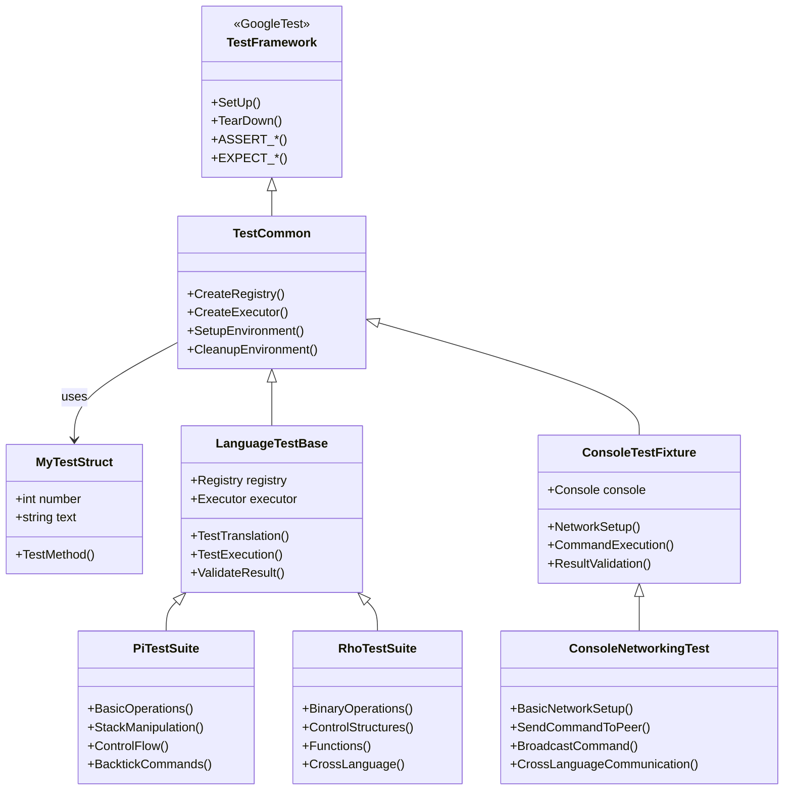

# KAI Test System Architecture

## Test Suite Organization

## Test Infrastructure Components

## Test Execution Flow

## Language Test Coverage

## Console Test Categories

## Test Data Flow and Validation

## Test Suite Statistics

## Continuous Integration Flow

