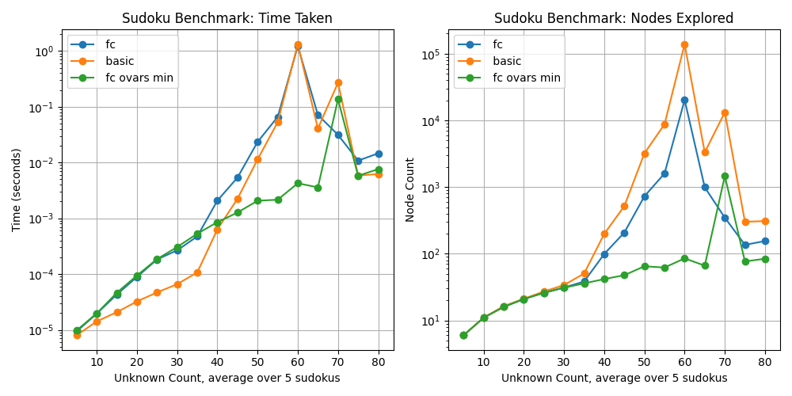

.. role::  raw-html(raw)
    :format: html

========================
CSP Fork (PIA) |license|
========================
|cmake| |Coveralls| |Documentation Status|

CSP is a library containing an implementation of a CSP solver whose content has
been partially generated using copilot. The latter is a backtracking algorithm
that solves a CSP by assigning values to variables from their domains and
checking if the assignment is consistent.

For the course `Imperative Programming - Avancé`_, after all lessons and exams,
we're assigned to fork this library made by our teacher that solves `Constraint
Satisfaction Problems (CSPs)`_. The goal of this project, in teams of up to 6
students, is to upgrade the backtracking algorithm with a forward checking and
to implement heuristics to order variables and values. We also have to benchmark
and compare our modifications by solving `Sudoku`_ and `N-Queens`_ puzzles.

So, the `GitHub repository`_ contains the work of the **G team** for this
assignment and has its `ReadTheDocs documentation`_.

> Version: **v2.0.0**

> Deadline: **Friday, May 23, 2025 at 23:00 (Completed on time on 27 May)**

.. |license| image:: https://img.shields.io/badge/License-LGPL_v3-orange.svg
	:alt: License: LGPL v3
	:target: https://www.gnu.org/licenses/lgpl-3.0.md
.. |cmake| image:: https://github.com/Xibitol/csp-fork/actions/workflows/cmake.yml/badge.svg
   :target: https://github.com/Xibitol/csp-fork/actions
.. |Coveralls| image:: https://coveralls.io/repos/github/Xibitol/csp-fork/badge.svg?branch=master
    :target: https://coveralls.io/github/Xibitol/csp-fork?branch=master
.. |Documentation Status| image:: https://readthedocs.org/projects/csp-fork/badge/?version=latest&style=flat
   :target: https://csp-fork.readthedocs.io/en/latest/
.. _`Imperative Programming - Avancé`:
	https://moodle.univ-lr.fr/2024/course/view.php?id=3202
.. _`Constraint Satisfaction Problems (CSPs)`:
	https://en.wikipedia.org/wiki/Constraint_satisfaction_problem
.. _`Sudoku`:
	https://en.wikipedia.org/wiki/Sudoku
.. _`N-Queens`:
	https://en.wikipedia.org/wiki/Eight_queens_puzzle

************
Performances
************

.. image:: Content/Screenshot/NQueens_Benchmark.png

*************
Documentation
*************
- `Project guidelines`_ given for this assignment.
- `GitHub repository`_ hosting the source code.
- `ReadTheDocs documentation`_ hosting library's documentation.
- `Project report`_ describing what we did.

.. _`Project guidelines`: Content/Document/PIA-Project_2024-2025.pdf
.. _`GitHub repository`: https://github.com/Xibitol/csp-fork
.. _`ReadTheDocs documentation`: https://csp-fork.readthedocs.io/en/latest/
.. _`Project report`: /#

Technician installation guide
=============================
*Soon ...*

Developer preparation guide
===========================
Clone the repository and run the following in your preferred CLI:

.. code-block:: bash

	cmake -S . -B out

Next, move into ``out`` and should be about to build, test and btest our
project. For more advanced checks, please refer to ``cmake/`` packages.

*******
License
*******
| PIA CSP (Library and benchmarking program)
Copyright :raw-html:`&copy;` 2025 - **G team**

These programs is free software: you can redistribute it and/or modify it under
the terms of the GNU Lesser General Public License as published by the Free
Software Foundation, either version 3 of the License, or (at your option) any
later version.

These last are distributed in the hope that it will be useful, but WITHOUT ANY
WARRANTY; without even the implied warranty of MERCHANTABILITY or FITNESS FOR A
PARTICULAR PURPOSE. See the GNU Lesser General Public License for more details.

You should have received a copy of the GNU General Public License and the GNU
Lesser General Public License along with the programs (Links: `GNU GPL v3`_ &
`GNU LGPL v3`_. If not, see https://www.gnu.org/licenses/.

.. _`GNU GPL v3`: COPYING
.. _`GNU LGPL v3`: COPYING.LESSER

**********
Developers
**********
> `χristoφe Демко`_ (Former Developer & Our Teacher)

> `Xibitol`_ (Project Leader & DevOps Engineer & Developer)

> `Valentin GEGADEN`_ (Developer)

> `nandeee_753`_ (Developer)

> `Ryan Heuvel`_ (Developer)

> `Adrien Gueguen`_ (Developer & Benchmarker)

> `LeGoblin`_ (QA Tester)

.. _`χristoφe Демко`: https://github.com/chdemko

.. _`Xibitol`: https://github.com/Xibitol
.. _`Valentin GEGADEN`: https://github.com/vgegaden
.. _`nandeee_753`: https://github.com/adnan-faize
.. _`Ryan Heuvel`: https://github.com/I-love-C
.. _`Adrien Gueguen`: https://github.com/agueguen-LR
.. _`LeGoblin`: https://github.com/Kefthe
